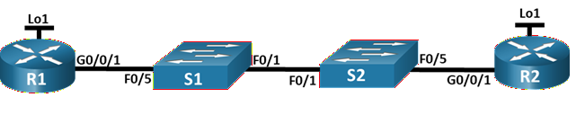
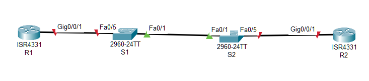

#  Настройка протокола OSPFv2 для одной области



### Цели

### Часть 1. Создание сети и настройка основных параметров устройства

### Часть 2. Настройка и проверка базовой работы протокола  OSPFv2 для одной области

### Часть 3. Оптимизация и проверка конфигурации OSPFv2 для одной области

##  Исходные данные:

### Таблица адресации

| Устройство       | Интерфейс      | IP-адрес       | Маска подсети|
|:-----------------|:---------------|:--------------------|:-------|
| R1               | G0/0/1       | 10.53.0.1| 255.255.255.0|
|                  | Loopback 1       | 172.16.1.1| 255.255.255.0|
| R2               | G0/0/1       | 10.53.0.2| 255.255.255.0|
|                  | Loopback 1       | 192.168.1.1| 255.255.255.0|

###  Решение:

# Часть 1. Создание сети и настройка основных параметров устройства

###  1. Создайте сеть согласно топологии.



### 2. Произведите базовую настройку маршрутизаторов.

Файлы конфигурации [здесь](config_R1.txt) и [здесь](config_R2.txt)

### 3. Настройте базовые параметры каждого коммутатора.

Файлы конфигурации [здесь](config_S1.txt) и [здесь](config_S2.txt)

# Часть 2. Настройка и проверка базовой работы протокола OSPFv2 для одной области

### 1. Настройте адреса интерфейса и базового OSPFv2 на каждом маршрутизаторе.

a. Настройте адреса интерфейсов на каждом маршрутизаторе, как показано в таблице адресации выше.

```
R1#sh ip interface brief
Interface              IP-Address      OK? Method Status                Protocol 
GigabitEthernet0/0/0   unassigned      YES unset  administratively down down 
GigabitEthernet0/0/1   10.53.0.1       YES manual up                    up 
GigabitEthernet0/0/2   unassigned      YES unset  administratively down down 
Loopback1              172.16.1.1      YES manual up                    up 
Vlan1                  unassigned      YES unset  administratively down down
```

```
R2#sh ip interface brief
Interface              IP-Address      OK? Method Status                Protocol 
GigabitEthernet0/0/0   unassigned      YES unset  administratively down down 
GigabitEthernet0/0/1   10.53.0.2       YES manual up                    up 
GigabitEthernet0/0/2   unassigned      YES unset  administratively down down 
Loopback1              192.168.1.1     YES manual up                    up 
Vlan1                  unassigned      YES unset  administratively down down
R2#
```

b. Перейдите в режим конфигурации маршрутизатора OSPF, используя идентификатор процесса 56.

c. Настройте статический идентификатор маршрутизатора для каждого маршрутизатора (1.1.1.1 для R1, 2.2.2.2 для R2).

d. Настройте инструкцию сети для сети между R1 и R2, поместив ее в область 0.

```
R1(config)# router ospf 56
R1(config-router)#router-id 1.1.1.1
R1(config-router)# network 10.53.0.0 0.0.0.255 area 0
```

e. Только на R2 добавьте конфигурацию, необходимую для объявления сети Loopback 1 в область OSPF 0.

```
R2(config)# router ospf 56
R2(config-router)# router-id 2.2.2.2
R2(config-router)#network 10.53.0.0 0.0.0.255 area 0
R2(config-router)#network 192.168.1.0 0.0.0.255 area 0
```

f. Убедитесь, что OSPFv2 работает между маршрутизаторами. Выполните команду, чтобы убедиться, что R1 и R2 сформировали смежность.

Посмотрим интерфейсы участвующие в работе протокола OSPF

Команда *sh ip ospf int brief* не поддерживается в версии CPT.

```
R1#sh ip ospf int g0/0/1

GigabitEthernet0/0/1 is up, line protocol is up
  Internet address is 10.53.0.1/24, Area 0
  Process ID 56, Router ID 1.1.1.1, Network Type BROADCAST, Cost: 1
  Transmit Delay is 1 sec, State BDR, Priority 1
  Designated Router (ID) 2.2.2.2, Interface address 10.53.0.2
  Backup Designated Router (ID) 1.1.1.1, Interface address 10.53.0.1
  Timer intervals configured, Hello 10, Dead 40, Wait 40, Retransmit 5
    Hello due in 00:00:00
  Index 1/1, flood queue length 0
  Next 0x0(0)/0x0(0)
  Last flood scan length is 1, maximum is 1
  Last flood scan time is 0 msec, maximum is 0 msec
  Neighbor Count is 1, Adjacent neighbor count is 1
    Adjacent with neighbor 2.2.2.2  (Designated Router)
  Suppress hello for 0 neighbor(s)
```

```
R2#sh ip ospf int g0/0/1

GigabitEthernet0/0/1 is up, line protocol is up
  Internet address is 10.53.0.2/24, Area 0
  Process ID 56, Router ID 2.2.2.2, Network Type BROADCAST, Cost: 1
  Transmit Delay is 1 sec, State DR, Priority 1
  Designated Router (ID) 2.2.2.2, Interface address 10.53.0.2
  Backup Designated Router (ID) 1.1.1.1, Interface address 10.53.0.1
  Timer intervals configured, Hello 10, Dead 40, Wait 40, Retransmit 5
    Hello due in 00:00:05
  Index 1/1, flood queue length 0
  Next 0x0(0)/0x0(0)
  Last flood scan length is 1, maximum is 1
  Last flood scan time is 0 msec, maximum is 0 msec
  Neighbor Count is 1, Adjacent neighbor count is 1
    Adjacent with neighbor 1.1.1.1  (Backup Designated Router)
  Suppress hello for 0 neighbor(s)

R2#sh ip ospf int Loopback 1

Loopback1 is up, line protocol is up
  Internet address is 192.168.1.1/24, Area 0
  Process ID 56, Router ID 2.2.2.2, Network Type LOOPBACK, Cost: 1
  Loopback interface is treated as a stub Host
```

Посмотрим какие маршрутизаторы участвуют в обмене информации о маршрутизаторах и маршрутах в сети:

``` 
R1#sh ip ospf neighbor


Neighbor ID     Pri   State           Dead Time   Address         Interface
2.2.2.2           1   FULL/DR         00:00:30    10.53.0.2       GigabitEthernet0/0/1
```

```
R2# sh ip ospf neighbor


Neighbor ID     Pri   State           Dead Time   Address         Interface
1.1.1.1           1   FULL/BDR        00:00:38    10.53.0.1       GigabitEthernet0/0/1
```

### Вопрос:

### Какой маршрутизатор является DR? - R2

### Какой маршрутизатор является BDR? - R1

### Каковы критерии отбора? - Выбор маршрутизатора R2 назначенным DR обусловлен тем, что у него значение идентификатора маршрутизатора (router-id) больше, чем у маршрутизатора R1.

g. На R1 выполните команду show ip route ospf, чтобы убедиться, что сеть R2 Loopback1 присутствует в таблице маршрутизации. Обратите внимание, что поведение OSPF по умолчанию заключается в объявлении интерфейса обратной связи в качестве маршрута узла с использованием 32-битной маски.

```
R1#show ip route ospf
     192.168.1.0/32 is subnetted, 1 subnets
O       192.168.1.1 [110/2] via 10.53.0.2, 00:23:50, GigabitEthernet0/0/1
```

h. Запустите Ping до адреса интерфейса R2 Loopback 1 из R1. Выполнение команды ping должно быть успешным.

```
R1# ping 192.168.1.1

Type escape sequence to abort.
Sending 5, 100-byte ICMP Echos to 192.168.1.1, timeout is 2 seconds:
!!!!!
Success rate is 100 percent (5/5), round-trip min/avg/max = 0/1/7 ms
```

# Часть 3. Оптимизация и проверка конфигурации OSPFv2 для одной области

### 1. Реализация различных оптимизаций на каждом маршрутизаторе.

a. На R1 настройте приоритет OSPF интерфейса G0/0/1 на 50, чтобы убедиться, что R1 является назначенным маршрутизатором.

b. Настройте таймеры OSPF на G0/0/1 каждого маршрутизатора для таймера приветствия, составляющего 30 секунд.

```
R1(config)#int g0/0/1
R1(config-if)#ip ospf priority 50
R1(config-if)#ip ospf hello-interval 30
```
```
R2(config)# int g0/0/1
R2(config-if)#ip ospf hello-interval 30
```

c. На R1 настройте статический маршрут по умолчанию, который использует интерфейс Loopback 1 в качестве интерфейса выхода. Затем распространите маршрут по умолчанию в OSPF. Обратите внимание на сообщение консоли после установки маршрута по умолчанию.

```
R1(config)#ip route 0.0.0.0 0.0.0.0 loopback 1
%Default route without gateway, if not a point-to-point interface, may impact performance
R1(config)#router ospf 56
R1(config-router)# default-information originate
```

d. добавьте конфигурацию, необходимую для OSPF для обработки R2 Loopback 1 как сети точка-точка. Это приводит к тому, что OSPF объявляет Loopback 1 использует маску подсети интерфейса.

```
R2(config)#int lo1
R2(config-if)#ip ospf network point-to-point
```

```
R2#sh ip ospf int lo1

Loopback1 is up, line protocol is up
  Internet address is 192.168.1.1/24, Area 0
  Process ID 56, Router ID 2.2.2.2, Network Type POINT-TO-POINT, Cost: 1
  Transmit Delay is 1 sec, State POINT-TO-POINT,
  Timer intervals configured, Hello 10, Dead 40, Wait 40, Retransmit 5
  Index 2/2, flood queue length 0
  Next 0x0(0)/0x0(0)
  Last flood scan length is 1, maximum is 1
  Last flood scan time is 0 msec, maximum is 0 msec
  Suppress hello for 0 neighbor(s)
```

e. Только на R2 добавьте конфигурацию, необходимую для предотвращения отправки объявлений OSPF в сеть Loopback 1.

```
R2(config)#router ospf 56
R2(config-router)#passive-interface loopback 1

R2#sh ip pro

Routing Protocol is "ospf 56"
  Outgoing update filter list for all interfaces is not set 
  Incoming update filter list for all interfaces is not set 
  Router ID 2.2.2.2
  Number of areas in this router is 1. 1 normal 0 stub 0 nssa
  Maximum path: 4
  Routing for Networks:
    10.53.0.0 0.0.0.255 area 0
    192.168.1.0 0.0.0.255 area 0
  Passive Interface(s): 
    Loopback1
  Routing Information Sources:  
    Gateway         Distance      Last Update 
    2.2.2.2              110      00:02:32
  Distance: (default is 110)
```

f. Измените базовую пропускную способность для маршрутизаторов. После этой настройки перезапустите OSPF с помощью команды clear ip ospf process . Обратите внимание на сообщение консоли после установки новой опорной полосы пропускания.

Текущие настройки:

```
R1#sh int gi0/0/1
GigabitEthernet0/0/1 is up, line protocol is up (connected)
  Hardware is ISR4331-3x1GE, address is 000b.be12.3702 (bia 000b.be12.3702)
  Internet address is 10.53.0.1/24
  MTU 1500 bytes, BW 1000000 Kbit, DLY 100 usec,
...

R1# sh ip ospf
 Routing Process "ospf 56" with ID 1.1.1.1
 Supports only single TOS(TOS0) routes
 Supports opaque LSA
 SPF schedule delay 5 secs, Hold time between two SPFs 10 secs
 Minimum LSA interval 5 secs. Minimum LSA arrival 1 secs
 Number of external LSA 1. Checksum Sum 0x00fecf
 Number of opaque AS LSA 0. Checksum Sum 0x000000
 Number of DCbitless external and opaque AS LSA 0
 Number of DoNotAge external and opaque AS LSA 0
 Number of areas in this router is 1. 1 normal 0 stub 0 nssa
 External flood list length 0
    Area BACKBONE(0)
        Number of interfaces in this area is 1
        Area has no authentication
        SPF algorithm executed 7 times
        Area ranges are
        Number of LSA 4. Checksum Sum 0x020e26
        Number of opaque link LSA 0. Checksum Sum 0x000000
        Number of DCbitless LSA 0
        Number of indication LSA 0
        Number of DoNotAge LSA 0
        Flood list length 0

R1# sh ip ospf int g0/0/1

GigabitEthernet0/0/1 is up, line protocol is up
  Internet address is 10.53.0.1/24, Area 0
  Process ID 56, Router ID 1.1.1.1, Network Type BROADCAST, Cost: 1
  Transmit Delay is 1 sec, State DR, Priority 50
  Designated Router (ID) 1.1.1.1, Interface address 10.53.0.1
  Backup Designated Router (ID) 2.2.2.2, Interface address 10.53.0.2
  Timer intervals configured, Hello 30, Dead 40, Wait 40, Retransmit 5
    Hello due in 00:00:27
  Index 1/1, flood queue length 0
  Next 0x0(0)/0x0(0)
  Last flood scan length is 1, maximum is 1
  Last flood scan time is 0 msec, maximum is 0 msec
  Neighbor Count is 1, Adjacent neighbor count is 1
    Adjacent with neighbor 2.2.2.2  (Backup Designated Router)
  Suppress hello for 0 neighbor(s)
```

##### До изменения проверим пинги от R2

```
R2#ping 172.16.1.1

Type escape sequence to abort.
Sending 5, 100-byte ICMP Echos to 172.16.1.1, timeout is 2 seconds:
!!!!!
Success rate is 100 percent (5/5), round-trip min/avg/max = 0/1/7 ms
```

Изменим базовую пропускную способность:
 
```
R1(config)# router ospf 56
R1(config-router)# auto-cost reference-bandwidth 1
```
Перезапустим процессы OSPF на маршрутизаторах, чтобы изменения вступили в силу:

 R# clear ip ospf process

```
R1#sh ip ospf int gi0/0/1

GigabitEthernet0/0/1 is up, line protocol is up
  Internet address is 10.53.0.1/24, Area 0
  Process ID 56, Router ID 1.1.1.1, Network Type BROADCAST, Cost: 0
  Transmit Delay is 1 sec, State DR, Priority 50
  Designated Router (ID) 1.1.1.1, Interface address 10.53.0.1
  Backup Designated Router (ID) 2.2.2.2, Interface address 10.53.0.2
  Timer intervals configured, Hello 30, Dead 40, Wait 40, Retransmit 5
    Hello due in 00:00:17
  Index 1/1, flood queue length 0
  Next 0x0(0)/0x0(0)
  Last flood scan length is 1, maximum is 1
  Last flood scan time is 0 msec, maximum is 0 msec
  Neighbor Count is 1, Adjacent neighbor count is 1
    Adjacent with neighbor 2.2.2.2  (Backup Designated Router)
  Suppress hello for 0 neighbor(s)
```

Проверим итоговое состояние по таблицам маршрутизации

```
R1# sh ip route
Codes: L - local, C - connected, S - static, R - RIP, M - mobile, B - BGP
       D - EIGRP, EX - EIGRP external, O - OSPF, IA - OSPF inter area
       N1 - OSPF NSSA external type 1, N2 - OSPF NSSA external type 2
       E1 - OSPF external type 1, E2 - OSPF external type 2, E - EGP
       i - IS-IS, L1 - IS-IS level-1, L2 - IS-IS level-2, ia - IS-IS inter area
       * - candidate default, U - per-user static route, o - ODR
       P - periodic downloaded static route

Gateway of last resort is 0.0.0.0 to network 0.0.0.0

     10.0.0.0/8 is variably subnetted, 2 subnets, 2 masks
C       10.53.0.0/24 is directly connected, GigabitEthernet0/0/1
L       10.53.0.1/32 is directly connected, GigabitEthernet0/0/1
     172.16.0.0/16 is variably subnetted, 2 subnets, 2 masks
C       172.16.1.0/24 is directly connected, Loopback1
L       172.16.1.1/32 is directly connected, Loopback1
O    192.168.1.0/24 [110/1] via 10.53.0.2, 00:04:12, GigabitEthernet0/0/1
S*   0.0.0.0/0 is directly connected, Loopback1
```

### 2. Убедитесь, что оптимизация OSPFv2 реализовалась.

a. Выполните команду show ip ospf interface g0/0/1 на R1

```
R1#show ip ospf interface g0/0/1

GigabitEthernet0/0/1 is up, line protocol is up
  Internet address is 10.53.0.1/24, Area 0
  Process ID 56, Router ID 1.1.1.1, Network Type BROADCAST, Cost: 0
  Transmit Delay is 1 sec, State DR, Priority 50
  Designated Router (ID) 1.1.1.1, Interface address 10.53.0.1
  Backup Designated Router (ID) 2.2.2.2, Interface address 10.53.0.2
  Timer intervals configured, Hello 30, Dead 40, Wait 40, Retransmit 5
    Hello due in 00:00:17
  Index 1/1, flood queue length 0
  Next 0x0(0)/0x0(0)
  Last flood scan length is 1, maximum is 1
  Last flood scan time is 0 msec, maximum is 0 msec
  Neighbor Count is 1, Adjacent neighbor count is 1
    Adjacent with neighbor 2.2.2.2  (Backup Designated Router)
  Suppress hello for 0 neighbor(s)
```

b. На R1 выполните команду show ip route ospf, чтобы убедиться, что сеть R2 Loopback1 присутствует в таблице маршрутизации.
```
R1#show ip route ospf
O    192.168.1.0 [110/1] via 10.53.0.2, 00:09:02, GigabitEthernet0/0/1
```

c. Введите команду show ip route ospf на маршрутизаторе R2. Единственная информация о маршруте OSPF должна быть распространяемый по умолчанию маршрут R1.

d. Запустите Ping до адреса интерфейса R1 Loopback 1 из R2. Выполнение команды ping должно быть успешным.


### Вопрос:

### Почему стоимость OSPF для маршрута по умолчанию отличается от стоимости OSPF в R1 для сети 192.168.1.0/24?
