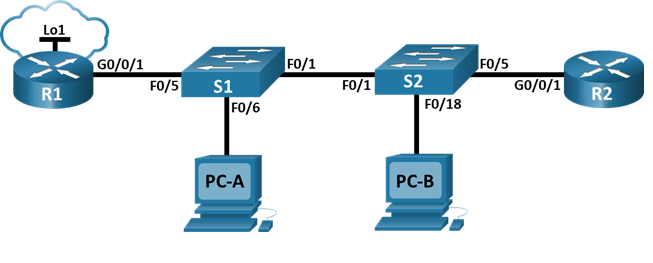
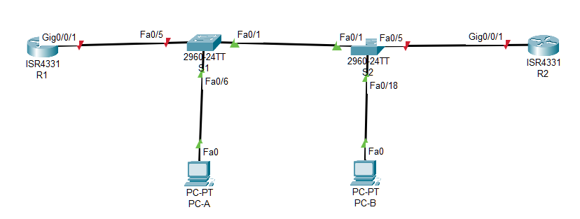

#  Настройка и проверка расширенных списков контроля доступа



###  Задание:

Часть 1. Создание сети и настройка основных параметров устройства

Часть 2. Настройка и проверка списков расширенного контроля доступа


###  Исходные данные:

## 1 Таблица адресации

| Устройство|	Интерфейс|	IP-адрес|	Маска подсети|	Шлюз по умолчанию|
|:----------|:----------|:----------|:----------|:----------|
|R1|	G0/0/1|	—	|—|	—|
|R1|	G0/0/1.20|		*10.20.0.1*	| *255.255.255.0* |	—|
|R1|	G0/0/1.30|		*10.30.0.1*	| *255.255.255.0* |	—|
|R1|	G0/0/1.40|	*10.40.0.1*	| *255.255.255.0* |	—|
|R1|	G0/0/1.1000|	—	|—|	—|
|R1|	Loopback1|	*172.16.1.1*	| *255.255.255.0* |	—|
|R2|	G0/0/1|*10.20.0.4*|*255.255.255.0*|	—|		
|S1|	VLAN 20|*10.20.0.2*| *255.255.255.0*|	*10.20.0.1*|
|S2|	VLAN 20|*10.20.0.3*| *255.255.255.0*|	*10.20.0.1*|
|PC-A|	NIC|	*10.30.0.10*| *255.255.255.0*|	*10.30.0.1*|
|PC-B|	NIC|	*10.40.0.10*| *255.255.255.0*|	*10.40.0.1*|

## 2 Таблица VLAN

|VLAN|	Имя	|Назначенный интерфейс|
|:----------|:----------|:--------|
|20|	Manadement|	S2: F0/5|
|30|	Operations|	S1: F0/6| 
|40|	Sales|	S2: F0/18  |
|999|	Parking_Lot	|S1: F0/2-4, F0/7-24, G0/1-2; S2: F0/2-4, F0/6-17, F0/19-24, G0/1-2|
|1000	|Собственная|	—|


###  Решение:

# Часть 1. Создание сети и настройка основных параметров устройства


###  1. Создайте сеть согласно топологии.



### 2. Произведите базовую настройку маршрутизаторов.

a. Назначьте имя устройства.

b. Отключите поиск DNS, чтобы предотвратить попытки маршрутизатора неверно преобразовывать введенные команды таким образом, как будто они являются именами узлов.

c. Назначьте class в качестве зашифрованного пароля привилегированного режима EXEC.

d. Назначьте cisco в качестве пароля консоли и включите вход в систему по паролю.

e. Назначьте cisco в качестве пароля VTY и включите вход в систему по паролю.

f. Зашифруйте открытые пароли.

g. Создайте баннер с предупреждением о запрете несанкционированного доступа к устройству.

h. Сохраните текущую конфигурацию в файл загрузочной конфигурации.

### 3. Произведите базовую настройку коммутаторов.

a. Назначьте имя устройства.

b. Отключите поиск DNS, чтобы предотвратить попытки маршрутизатора неверно преобразовывать введенные команды таким образом, как будто они являются именами узлов.

c. Назначьте class в качестве зашифрованного пароля привилегированного режима EXEC.

d. Назначьте cisco в качестве пароля консоли и включите вход в систему по паролю.

e. Назначьте cisco в качестве пароля VTY и включите вход в систему по паролю.

f. Зашифруйте открытые пароли.

g. Создайте баннер с предупреждением о запрете несанкционированного доступа к устройству.

h. Сохраните текущую конфигурацию в файл загрузочной конфигурации.

# Часть 2. Настройка сетей VLAN на коммутаторах

### 1. Создайте сети VLAN на коммутаторах.

a.	Создайте необходимые VLAN и назовите их на каждом коммутаторе из приведенной выше таблицы.

b.	Настройте интерфейс управления и шлюз по умолчанию на каждом коммутаторе, используя информацию об IP-адресе в таблице адресации. 

c.	Назначьте все неиспользуемые порты коммутатора VLAN Parking Lot, настройте их для статического режима доступа и административно деактивируйте их.

Примечание. Команда interface range полезна для выполнения этой задачи с помощью необходимого количества команд

### 2. Назначьте сети VLAN соответствующим интерфейсам коммутатора.

a.	Назначьте используемые порты соответствующей VLAN (указанной в таблице VLAN выше) и настройте их для режима статического доступа.

b.	Выполните команду show vlan brief, чтобы убедиться, что сети VLAN назначены правильным интерфейсам.

# Часть 3. Настройте транки (магистральные каналы).

### 1. Вручную настройте магистральный интерфейс F0/1.

a.	Измените режим порта коммутатора на интерфейсе F0/1, чтобы принудительно создать магистральную связь. Не забудьте сделать это на обоих коммутаторах.

b.	В рамках конфигурации транка установите для native vlan значение 1000 на обоих коммутаторах. При настройке двух интерфейсов для разных собственных VLAN сообщения об ошибках могут отображаться временно.

c.	В качестве другой части конфигурации транка укажите, что VLAN 20, 30, 40 и 1000 разрешены в транке.

d.	Выполните команду show interfaces trunk для проверки портов магистрали, собственной VLAN и разрешенных VLAN через магистраль.


### ```

### ....

### ```

### 2. Вручную настройте магистральный интерфейс F0/5 на коммутаторе S1.

a.	Настройте интерфейс S1 F0/5 с теми же параметрами транка, что и F0/1. Это транк до маршрутизатора.

b.	Сохраните текущую конфигурацию в файл загрузочной конфигурации.

c.	Используйте команду show interfaces trunk для проверки настроек транка.


### ```

### ....

### ```

# Часть 4. Настройте маршрутизацию.

### 1. Настройка маршрутизации между сетями VLAN на R1.

a.	Активируйте интерфейс G0/0/1 на маршрутизаторе.

b.	Настройте подинтерфейсы для каждой VLAN, как указано в таблице IP-адресации. Все подинтерфейсы используют инкапсуляцию 802.1Q. Убедитесь, что подинтерфейс для собственной VLAN не имеет назначенного IP-адреса. Включите описание для каждого подинтерфейса.

c.	Настройте интерфейс Loopback 1 на R1 с адресацией из приведенной выше таблицы.

d.	С помощью команды show ip interface brief проверьте конфигурацию подынтерфейса.

### ```

### ....

### ```

### 2. Настройка интерфейса R2 g0/0/1 с использованием адреса из таблицы и маршрута по умолчанию с адресом следующего перехода 10.20.0.1.

# Часть 5. Настройте удаленный доступ.

### 1. Настройте все сетевые устройства для базовой поддержки SSH.

a.	Создайте локального пользователя с именем пользователя SSHadmin и зашифрованным паролем $cisco123!

b.	Используйте ccna-lab.com в качестве доменного имени.

c.	Генерируйте криптоключи с помощью 1024 битного модуля.

d.	Настройте первые пять линий VTY на каждом устройстве, чтобы поддерживать только SSH-соединения и с локальной аутентификацией.

### 2. Включите защищенные веб-службы с проверкой подлинности на R1.

a.	Включите сервер HTTPS на R1.

*R1(config)# ip http secure-server*

b.	Настройте R1 для проверки подлинности пользователей, пытающихся подключиться к веб-серверу.

*R1(config)# ip http authentication local*

# Часть 6. Проверка подключения.

### 1. Настройте узлы ПК.

Адреса ПК можно посмотреть в таблице адресации.

### 2. Выполните следующие тесты. Эхозапрос должен пройти успешно.

Примечание. Возможно, вам придется отключить брандмауэр ПК для работы ping


Файл лабораторной работы Cisco PT [здесь](lab11.pkt).


