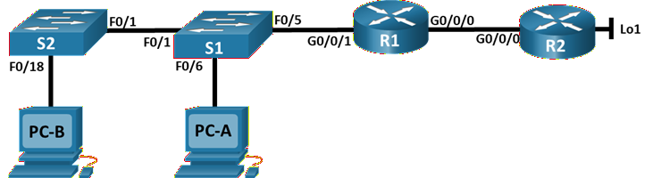
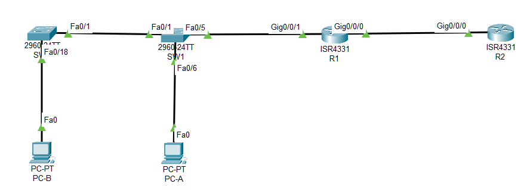

#  Настройка NAT для IPv4



###  Задание:

Часть 1. Создание сети и настройка основных параметров устройства

Часть 2. Настройка и проверка NAT для IPv4

Часть 3. Настройка и проверка PAT для IPv4

Часть 4. Настройка и проверка статического NAT для IPv4.

###  Исходные данные:

### Таблица адресации

| Устройство|	Интерфейс|	IP-адрес|	Маска подсети|
|:----------|:----------|:----------|:----------|
|R1|	G0/0/0|	*209.165.200.230*|*255.255.255.248*|
|R1|	G0/0/1|		*192.168.1.1*	| *255.255.255.0* |	
|R2|	G0/0/0|*209.165.200.225*|*255.255.255.248*|		
|R2|	Loopback1|	*209.165.200.1*	| *255.255.255.224* |
|S1|	VLAN 1|*192.168.1.11*| *255.255.255.0*|
|S2|	VLAN 1|*192.168.1.12*| *255.255.255.0*|	
|PC-A|	NIC|	*192.168.1.2*| *255.255.255.0*|	
|PC-B|	NIC|	*192.168.1.3*| *255.255.255.0*|

###  Решение:

# Часть 1. Создание сети и настройка основных параметров устройства


###  1. Создайте сеть согласно топологии.



### 2. Произведите базовую настройку маршрутизаторов.

Файлы конфигурации [здесь](config_R1.txt) и [здесь](config_R2.txt)

### 3. Настройте базовые параметры каждого коммутатора.

Файлы конфигурации [здесь](config_S1.txt) и [здесь](config_S2.txt)

# Часть 2. Настройка и проверка NAT для IPv4

### 1. Настройте NAT на R1, используя пул из трех адресов 209.165.200.226-209.165.200.228. 

a. Настройте простой список доступа, который определяет, какие хосты будут разрешены для трансляции. В этом случае все устройства в локальной сети R1 имеют право на трансляцию.

*R1(config)# access-list 1 permit 192.168.1.0 0.0.0.255*

b. Создайте пул NAT и укажите ему имя и диапазон используемых адресов.

*R1(config)# ip nat pool PUBLIC_ACCESS 209.165.200.226 209.165.200.228 netmask 255.255.255.248*

Примечание. Параметр маски сети не является разделителем IP-адресов. Это должна быть правильная маска подсети для назначенных адресов, даже если вы используете не все адреса подсети в пуле. 

c. Настройте перевод, связывая ACL и пул с процессом преобразования.

*R1(config)# ip nat inside source list 1 pool PUBLIC_ACCESS*

Примечание: Три очень важных момента. Во-первых, слово «inside» имеет решающее значение для работы такого рода NAT. Если вы опустить его, NAT не будет работать. 
Во-вторых, номер списка — это номер ACL, настроенный на предыдущем шаге. В-третьих, имя пула чувствительно к регистру. 

d. Задайте внутренний (inside) интерфейс. 

```
R1(config)# interface g0/0/1
R1(config-if)# ip nat inside
```

e. Определите внешний (outside) интерфейс.

```
R1(config)# interface g0/0/0
R1(config-if)# ip nat outside
```

### 2. Проверьте и проверьте конфигурацию. 

a. С PC-B,  запустите эхо-запрос интерфейса Lo1 (209.165.200.1) на R2. Если эхо-запрос не прошел, выполните процес поиска и устранения неполадок. На R1 отобразите таблицу NAT на R1 с помощью команды show ip nat translations.

```
C:\>ping 209.165.200.1

Pinging 209.165.200.1 with 32 bytes of data:

Reply from 209.165.200.1: bytes=32 time<1ms TTL=254
Reply from 209.165.200.1: bytes=32 time<1ms TTL=254
Reply from 209.165.200.1: bytes=32 time<1ms TTL=254
Reply from 209.165.200.1: bytes=32 time<1ms TTL=254

Ping statistics for 209.165.200.1:
    Packets: Sent = 4, Received = 4, Lost = 0 (0% loss),
Approximate round trip times in milli-seconds:
    Minimum = 0ms, Maximum = 0ms, Average = 0ms
```

```
RR1# sh ip nat tran
Pro  Inside global     Inside local       Outside local      Outside global
icmp 209.165.200.226:37192.168.1.3:37     209.165.200.1:37   209.165.200.1:37
icmp 209.165.200.226:38192.168.1.3:38     209.165.200.1:38   209.165.200.1:38
icmp 209.165.200.226:39192.168.1.3:39     209.165.200.1:39   209.165.200.1:39
icmp 209.165.200.226:40192.168.1.3:40     209.165.200.1:40   209.165.200.1:40
icmp 209.165.200.226:41192.168.1.3:41     209.165.200.1:41   209.165.200.1:41
icmp 209.165.200.226:42192.168.1.3:42     209.165.200.1:42   209.165.200.1:42
icmp 209.165.200.226:43192.168.1.3:43     209.165.200.1:43   209.165.200.1:43
icmp 209.165.200.226:44192.168.1.3:44     209.165.200.1:44   209.165.200.1:44

R1#
```

### Вопросы:

#### Во что был транслирован внутренний локальный адрес PC-B?

#### *PC-B (192.168.1.3) транслируется в 209.165.200.226*

#### Какой тип адреса NAT является переведенным адресом?

#### *Тип адреса: Inside Global*
 
b. С PC-A, запустите  эхо-запрос интерфейса Lo1 (209.165.200.1) на R2. Если эхо-запрос не прошел, выполните отладку. На R1 отобразите таблицу NAT на R1 с помощью команды show ip nat translations.

```
C:\>ping 209.165.200.1

Pinging 209.165.200.1 with 32 bytes of data:

Reply from 209.165.200.1: bytes=32 time<1ms TTL=254
Reply from 209.165.200.1: bytes=32 time<1ms TTL=254
Reply from 209.165.200.1: bytes=32 time<1ms TTL=254
Reply from 209.165.200.1: bytes=32 time<1ms TTL=254

Ping statistics for 209.165.200.1:
    Packets: Sent = 4, Received = 4, Lost = 0 (0% loss),
Approximate round trip times in milli-seconds:
    Minimum = 0ms, Maximum = 0ms, Average = 0ms

```

```
R1# sh ip nat tran
Pro  Inside global     Inside local       Outside local      Outside global
icmp 209.165.200.226:45192.168.1.3:45     209.165.200.1:45   209.165.200.1:45
icmp 209.165.200.226:46192.168.1.3:46     209.165.200.1:46   209.165.200.1:46
icmp 209.165.200.226:47192.168.1.3:47     209.165.200.1:47   209.165.200.1:47
icmp 209.165.200.226:48192.168.1.3:48     209.165.200.1:48   209.165.200.1:48
icmp 209.165.200.227:5 192.168.1.2:5      209.165.200.1:5    209.165.200.1:5
icmp 209.165.200.227:6 192.168.1.2:6      209.165.200.1:6    209.165.200.1:6
icmp 209.165.200.227:7 192.168.1.2:7      209.165.200.1:7    209.165.200.1:7
icmp 209.165.200.227:8 192.168.1.2:8      209.165.200.1:8    209.165.200.1:8

```

c. Обратите внимание, что предыдущая трансляция для PC-B все еще находится в таблице. Из S1, эхо-запрос интерфейса Lo1 (209.165.200.1) на R2. Если эхо-запрос не прошел, выполните отладку. На R1 отобразите таблицу NAT на R1 с помощью команды show ip nat translations.

```
R1#sh ip nat tran
Pro  Inside global     Inside local       Outside local      Outside global
icmp 209.165.200.226:36192.168.1.11:36    209.165.200.1:36   209.165.200.1:36
icmp 209.165.200.226:37192.168.1.11:37    209.165.200.1:37   209.165.200.1:37
icmp 209.165.200.226:38192.168.1.11:38    209.165.200.1:38   209.165.200.1:38
icmp 209.165.200.226:39192.168.1.11:39    209.165.200.1:39   209.165.200.1:39
icmp 209.165.200.226:40192.168.1.11:40    209.165.200.1:40   209.165.200.1:40
icmp 209.165.200.227:57192.168.1.3:57     209.165.200.1:57   209.165.200.1:57
icmp 209.165.200.227:58192.168.1.3:58     209.165.200.1:58   209.165.200.1:58
icmp 209.165.200.227:59192.168.1.3:59     209.165.200.1:59   209.165.200.1:59
icmp 209.165.200.227:60192.168.1.3:60     209.165.200.1:60   209.165.200.1:60
icmp 209.165.200.228:17192.168.1.2:17     209.165.200.1:17   209.165.200.1:17
icmp 209.165.200.228:18192.168.1.2:18     209.165.200.1:18   209.165.200.1:18
icmp 209.165.200.228:19192.168.1.2:19     209.165.200.1:19   209.165.200.1:19
icmp 209.165.200.228:20192.168.1.2:20     209.165.200.1:20   209.165.200.1:20

```

d. Теперь запускаем пинг R2 Lo1 из S2. На этот раз перевод завершается неудачей, и вы получаете эти сообщения (или аналогичные) на консоли R1:

```
S1# ping 209.165.200.1

Type escape sequence to abort.
Sending 5, 100-byte ICMP Echos to 209.165.200.1, timeout is 2 seconds:
.....
Success rate is 0 percent (0/5)
```

e. Это ожидаемый результат, потому что выделено только 3 адреса, и мы попытались ping Lo1 с четырех устройств. Напомним, что NAT — это трансляция «один-в-один». Как много выделено трансляций? Введите команду show ip nat translations verbose , и вы увидите, что ответ будет 24 часа.

#### Команда *show ip nat translations verbose* не поддерживается версией CPT

f. Учитывая, что пул ограничен тремя адресами, NAT для пула адресов недостаточно для нашего приложения. Очистите преобразование NAT и статистику, и мы перейдем к PAT.

```
R1# clear ip nat translation * 
```
#### Команда *clear ip nat statistics* не поддерживается версией CPT

# Часть 3. Настройка и проверка PAT для IPv4.

### 1. Удалите команду преобразования на R1.

Компоненты конфигурации преобразования адресов в основном одинаковы; что-то (список доступа) для идентификации адресов, пригодных для перевода, дополнительно настроенный пул адресов для их преобразования и команды, необходимые для идентификации внутреннего и внешнего интерфейсов. Из части 1 наш список доступа (список доступа 1) по-прежнему корректен для сетевого сценария, поэтому нет необходимости воссоздавать его. Мы будем использовать один и тот же пул адресов, поэтому нет необходимости воссоздавать эту конфигурацию. Кроме того, внутренний и внешний интерфейсы не меняются. Чтобы начать работу в части 3, удалите команду, связывающую ACL и пул вместе.

*R1(config)# no ip nat inside source list 1 pool PUBLIC_ACCESS*

### 2. Добавьте команду PAT на R1.

Теперь настройте преобразование PAT в пул адресов (помните, что ACL и Pool уже настроены, так что это единственная команда, которую нам нужно изменить с NAT на PAT).

*R1(config)# ip nat inside source list 1 pool PUBLIC_ACCESS overload*

### 3. Протестируйте и проверьте конфигурацию.

a. Давайте проверим, что PAT работает. С PC-B,  запустите эхо-запрос интерфейса Lo1 (209.165.200.1) на R2. Если эхо-запрос не прошел, выполните отладку. На R1 отобразите таблицу NAT на R1 с помощью команды show ip nat translations.

```
R1#sh ip nat tran
Pro  Inside global     Inside local       Outside local      Outside global
icmp 209.165.200.228:73 192.168.1.3:73     209.165.200.1:73   209.165.200.1:73
icmp 209.165.200.228:74 192.168.1.3:74     209.165.200.1:74   209.165.200.1:74
icmp 209.165.200.228:75 192.168.1.3:75     209.165.200.1:75   209.165.200.1:75
icmp 209.165.200.228:76 192.168.1.3:76     209.165.200.1:76   209.165.200.1:76
```

### Вопросы:

#### Во что был транслирован внутренний локальный адрес PC-B?

#### *PC-B транслируется в 209.165.200.226 с использованием портов*

#### Какой тип адреса NAT является переведенным адресом?
 
#### Чем отличаются выходные данные команды show ip nat translations из упражнения NAT?

#### *Отличие от NAT: используется один внешний адрес для всех подключений. Маршрутизатор различает сессии по номерам портов*

b. С PC-A, запустите эхо-запрос интерфейса Lo1 (209.165.200.1) на R2. Если эхо-запрос не прошел, выполните отладку. На R1 отобразите таблицу NAT на R1 с помощью команды show ip nat translations.

```
R1#sh ip nat tran
Pro  Inside global     Inside local       Outside local      Outside global
icmp 209.165.200.228:33 192.168.1.2:33     209.165.200.1:33   209.165.200.1:33
icmp 209.165.200.228:34 192.168.1.2:34     209.165.200.1:34   209.165.200.1:34
icmp 209.165.200.228:35 192.168.1.2:35     209.165.200.1:35   209.165.200.1:35
icmp 209.165.200.228:36 192.168.1.2:36     209.165.200.1:36   209.165.200.1:36
```

Обратите внимание, что есть только одна трансляция. Отправьте ping еще раз, и быстро вернитесь к маршрутизатору и введите команду show ip nat translations verbose, и вы увидите, что произошло.

```
R1# show ip nat translations verbose 
Pro Inside global Inside local Outside local Outside global
icmp 209.165.200.226:1 192.168.1.2:1 209.165.200.1:1 209.165.200.1:1 
  create: 09/23/19 16:57:22, use: 09/23/19 16:57:25, timeout: 00:01:00
<output omitted>
```

Как вы можете видеть, время ожидания перевода было отменено с 24 часов до 1 минуты.

c. Генерирует трафик с нескольких устройств для наблюдения PAT. На PC-A и PC-B используйте параметр -t с командой ping, чтобы отправить безостановочный ping на интерфейс Lo1 R2 (ping -t 209.165.200.1), затем вернитесь к R1 и выполните команду show ip nat translations:

```
R1# show ip nat translations
Pro Inside global Inside local Outside local Outside global
icmp 209.165.200.226:1 192.168.1.2:1 209.165.200.1:1 209.165.200.1:1 
226:2 192.168.1. 3:1 209.165.200. 1:1 209.165.200. 1:2 
Total number of translations: 2
```

Обратите внимание, что внутренний глобальный адрес одинаков для обоих сеансов. 

### Вопрос:

Как маршрутизатор отслеживает, куда идут ответы? 
 
d. PAT в пул является очень эффективным решением для малых и средних организаций. Тем не менее есть неиспользуемые адреса IPv4, задействованные в этом сценарии. Мы перейдем к PAT с перегрузкой интерфейса, чтобы устранить эту трату IPv4 адресов. Остановите ping на PC-A и PC-B с помощью комбинации клавиш Control-C, затем очистите трансляции и статистику:

```
R1# clear ip nat translations * 
R1# clear ip nat statistics
```

### 4. На R1 удалите команды преобразования nat pool.

Опять же, наш список доступа (список доступа 1) по-прежнему корректен для сетевого сценария, поэтому нет необходимости воссоздавать его. Кроме того, внутренний и внешний интерфейсы не меняются. Чтобы начать работу с PAT к интерфейсу, очистите конфигурацию, удалив пул NAT и команду, связывающую ACL и пул вместе.

```
R1(config)# no ip nat inside source list 1 pool PUBLIC_ACCESS overload 
R1(config)# no ip nat pool PUBLIC_ACCESS
```

### 5. Добавьте команду PAT overload, указав внешний интерфейс.

Добавьте команду PAT, которая вызовет перегрузку внешнего интерфейса.

*R1(config)# ip nat inside source list 1 interface g0/0/0 overload*

### 6. Протестируйте и проверьте конфигурацию. 

a. Давайте проверим PAT, чтобы интерфейс работал. С PC-B,  запустите эхо-запрос интерфейса Lo1 (209.165.200.1) на R2. Если эхо-запрос не прошел, выполните отладку. На R1 отобразите таблицу NAT на R1 с помощью команды show ip nat translations.

```
R1# show ip nat translations
Pro Inside global Inside local Outside local Outside global
209.165.200. 230:1 192.168.1. 3:1 209.165.200. 1:1 209.165.200. 1:1 
Total number of translations: 1
```

b. Сделайте трафик с нескольких устройств для наблюдения PAT. На PC-A и PC-B используйте параметр -t с командой ping для отправки безостановочного ping на интерфейс Lo1 R2 (ping -t 209.165.200.1). На S1 и S2 выполните привилегированную команду exec ping 209.165.200.1 повторить 2000. Затем вернитесь к R1 и выполните команду show ip nat translations.

```
R1# show ip nat translations
Pro Inside global Inside local Outside local Outside global
209.165.200. 230:3 192.168.1. 11:1 209.165.200. 1:1 209.165.200. 1:3 
209.165.200. 230:2 192.168.1. 2:1 209.165.200. 1:1 209.165.200. 1:2 
209.165.200. 230:4 192.168.1. 3:1 209.165.200. 1:1 209.165.200. 1:4 
209.165.200. 230:1 192.168.1. 12:1 209.165.200. 1:1 209.165.200. 1:1 
Total number of translations: 4
```

Теперь все внутренние глобальные адреса сопоставляются с IP-адресом интерфейса g0/0/0.

Остановите все пинги. На PC-A и PC-B, используя комбинацию клавиш CTRL-C.

# Часть 4. Настройка и проверка статического NAT для IPv4.

### 1. На R1 очистите текущие трансляции и статистику.

```
R1# clear ip nat translations * 
R1# clear ip nat statistics
```

### 2. На R1 настройте команду NAT, необходимую для статического сопоставления внутреннего адреса с внешним адресом.

Для этого шага настройте статическое сопоставление между 192.168.1.11 и 209.165.200.1 с помощью следующей команды:

*R1(config)# ip nat inside source static 192.168.1.2 209.165.200.229*

### 3. Протестируйте и проверьте конфигурацию.

a. Давайте проверим, что статический NAT работает. На R1 отобразите таблицу NAT на R1 с помощью команды show ip nat translations, и вы увидите статическое сопоставление.

```
R1# show ip nat translations
Pro Inside global Inside local Outside local Outside global
--- 209.165.200.229 192.168.1.2 --- ---
Total number of translations: 1
```

b. Таблица перевода показывает, что статическое преобразование действует. Проверьте это, запустив ping  с R2 на 209.165.200.229. Плинги должны работать.
Примечание. Возможно, вам придется отключить брандмауэр ПК для работы pings.

c. На R1 отобразите таблицу NAT на R1 с помощью команды show ip nat translations, и вы увидите статическое сопоставление и преобразование на уровне порта для входящих pings.

```
R1# show ip nat translations
Pro Inside global Inside local Outside local Outside global
--- 209.165.200.229 192.168.1.2 --- ---
229:3 192.168.1. 2:3 209.165.200. 225:3 209.165.200. 225:3 209.165.200. 
Total number of translations: 2
```

Это подтверждает, что статический NAT работает.

Файл лабораторной работы Cisco PT [здесь](lab10.pkt).
