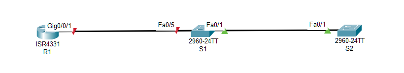

#  Настройка протоколов CDP, LLDP и NTP


###  Задание:

Часть 1. Создание сети и настройка основных параметров устройства

Часть 2. Обнаружение сетевых ресурсов с помощью протокола CDP

Часть 3. Обнаружение сетевых ресурсов с помощью протокола LLDP

Часть 4. Настройка и проверка NTP

###  Исходные данные:

### Таблица адресации

| Устройство|	Интерфейс|	IP-адрес|	Маска подсети| Шлюз по умолчанию |
|:----------|:----------|:----------|:----------|:----------|
|R1|	Loopback1 |	*172.16.1.1*|*255.255.255.0*| - |
|R1|	G0/0/1|	*10.22.0.1*|*255.255.255.0*| - |
|S1|	SVI VLAN 1|*10.22.0.2*| *255.255.255.0*| 10.22.0.1 |
|S2|	SVI VLAN 1|*10.22.0.3*| *255.255.255.0*| 10.22.0.1 |


###  Решение:

# Часть 1. Создание сети и настройка основных параметров устройства


###  1. Создайте сеть согласно топологии.



### 2. Произведите базовую настройку маршрутизатора.

Файлы конфигурации [здесь](config_R1.txt)

### 3. Настройте базовые параметры каждого коммутатора.

Файлы конфигурации [здесь](config_S1.txt) и [здесь](config_S2.txt)

# Часть 2. Обнаружение сетевых ресурсов с помощью протокола CDP

### 1. На устройствах Cisco протокол CDP включен по умолчанию. Воспользуйтесь CDP, чтобы обнаружить порты, к которым подключены кабели.

a. На R1 используйте соответствующую команду show cdp, чтобы определить, сколько интерфейсов включено CDP, сколько из них включено и сколько отключено.
 
#### Вопрос:

##### Сколько интерфейсов участвует в объявлениях CDP? Какие из них активны?

b. На R1 используйте соответствующую команду show cdp, чтобы определить версию IOS, используемую на S1.

```
R1 # show cdp entry  S1
-------------------------
Device ID: S1
Entry address(es):
Platform: cisco WS-C2960+24LC-L, Capabilities: Switch IGMP 
Interface: GigabitEthernet0/0/1, Port ID (outgoing port): FastEthernet0/5
Holdtime : 125 sec

Version :
Cisco IOS Software, C2960 Software (C2960-LANBASEK9-M), Version 15.2(4)E8, RELEASE SOFTWARE (fc3) 
Technical Support: http://www.cisco.com/techsupport
Copyright (c) 1986-2019 by Cisco Systems, Inc.
Compiled Fri 15-Mar-19 17:28 by prod_rel_team 

advertisement version: 2
VTP Management Domain: ''
Native VLAN: 1
Duplex: full
```

#### Вопрос:

##### Какая версия IOS используется на  S1?

c. На S1 используйте соответствующую команду show cdp, чтобы определить, сколько пакетов CDP было выданных.

```
S1# show cdp traffic
CDP counters : 
        Total packets output: 179, Input: 148 
        Hdr syntax: 0, Chksum error: 0, Encaps failed: 0 
        No memory: 0, Invalid packet: 0, 
        CDP version 1 advertisements output: 0, Input: 0 
        CDP version 2 advertisements output: 179, Input: 148
```

##### Вопрос:
##### Сколько пакетов имеет выход CDP с момента последнего сброса счетчика?

d. Настройте SVI для VLAN 1 на S1 и S2, используя IP-адреса, указанные в таблице адресации выше. Настройте шлюз по умолчанию для каждого коммутатора на основе таблицы адресов.

e. На R1 выполните команду show cdp entry S1 . 

#### Вопрос:

#### Какие дополнительные сведения доступны теперь?

```
R1 # show cdp entry  S1 
-------------------------
Device ID: S1
Entry address(es):
  IP address: 10.22.0.2
Platform: cisco WS-C2960+24LC-L, Capabilities: Switch IGMP 
Interface: GigabitEthernet0/0/1, Port ID (outgoing port): FastEthernet0/5
Holdtime : 133 sec

Version :
Cisco IOS Software, C2960 Software (C2960-LANBASEK9-M), Version 15.2(4)E8, RELEASE SOFTWARE (fc3) 
Technical Support: http://www.cisco.com/techsupport
Copyright (c) 1986-2019 by Cisco Systems, Inc.
Compiled Fri 15-Mar-19 17:28 by prod_rel_team 

advertisement version: 2
VTP Management Domain: ''
Native VLAN: 1
Duplex: full
Management address(es):
  IP address: 10.22.0.2 
```

f. Отключить CDP глобально на всех устройствах.

# Часть 3. Обнаружение сетевых ресурсов с помощью протокола LLDP

На устройствах Cisco протокол LLDP может быть включен по умолчанию. Воспользуйтесь LLDP, чтобы обнаружить порты, к которым подключены кабели.

a. Введите соответствующую команду lldp, чтобы включить LLDP на всех устройствах в топологии.

b. На S1 выполните соответствующую команду lldp, чтобы предоставить подробную информацию о S2. 

```
S1# show lldp entry S2

Capability codes:
    (R) Router, (B) Bridge, (T) Telephone, (C) DOCSIS Cable Device
    (W) WLAN Access Point, (P) Repeater, (S) Station, (O) Other
------------------------------------------------
Local Intf: Fa0/1  
Chassis id: c025.5cd7.ef00 
Port id: Fa0/1 
Port Description: FastEthernet0/1
System Name: S2

System Description:
Cisco IOS Software, C2960 Software (C2960-LANBASEK9-M), Version 15.2(4)E8, RELEASE SOFTWARE (fc3) 
Technical Support: http://www.cisco.com/techsupport
Copyright (c) 1986-2019 by Cisco Systems, Inc.
Compiled Fri 15-Mar-19 17:28 by prod_rel_team 

Time remaining: 109 seconds 
System Capabilities: B
Enabled Capabilities: B
Management Addresses:
    IP: 10.22.0.3 
Auto Negotiation - supported, enabled
Physical media capabilities:
    100base-TX(FD)
    100base-TX(HD)
    10base-T(FD)
    10base-T(HD)
Media Attachment Unit type: 16
Vlan ID: 1


Total entries displayed: 1
```

#### Вопрос:

#### Что такое chassis ID  для коммутатора S2?

c. Соединитесь через консоль на всех устройствах и используйте команды LLDP, необходимые для отображения топологии физической сети только из выходных данных команды show.
 
# Часть 4. Настройка NTP

В части 4 необходимо настроить маршрутизатор R1 в качестве сервера NTP, а маршрутизатор R2 в качестве клиента NTP маршрутизатора R1. Необходимо выполнить синхронизацию времени для Syslog и отладочных функций. Если время не синхронизировано, сложно определить, какое сетевое событие стало причиной данного сообщения.

### 1. Выведите на экран текущее время.

Введите команду show clock для отображения текущего времени на R1. Запишите отображаемые сведения о текущем времени в следующей таблице.

Дата	Время	Часовой пояс	Источник времени
			
### 2. Установите время.

С помощью команды clock set установите время на маршрутизаторе R1. Введенное время должно быть в формате UTC. 
 
### 3. Настройте главный сервер NTP.

Настройте R1 в качестве хозяина NTP с уровнем слоя 4.
 
### 4. Настройте клиент NTP.

a. Выполните соответствующую команду на S1 и S2, чтобы просмотреть настроенное время. Запишите текущее время,  в следующей таблице.

Дата	Время	Часовой пояс
		
b. Настройте S1 и S2 в качестве клиентов NTP. Используйте соответствующие команды NTP для получения времени от интерфейса G0/0/1 R1, а также для периодического обновления календаря или аппаратных часов коммутатора.

### 5. Проверьте настройку NTP.
                
a. Используйте соответствующую команду show , чтобы убедиться, что S1 и S2 синхронизированы с R1.

Примечание. Синхронизация метки времени на маршрутизаторе R2 с меткой времени на маршрутизаторе R1 может занять несколько минут.

b. Выполните соответствующую команду на S1 и S2, чтобы просмотреть настроенное время и сравнить ранее записанное время.

#### Вопрос для повторения

#### Для каких интерфейсов в пределах сети не следует использовать протоколы обнаружения сетевых ресурсов? Поясните ответ.

Файл лабораторной работы Cisco PT [здесь](lab10.pkt).
