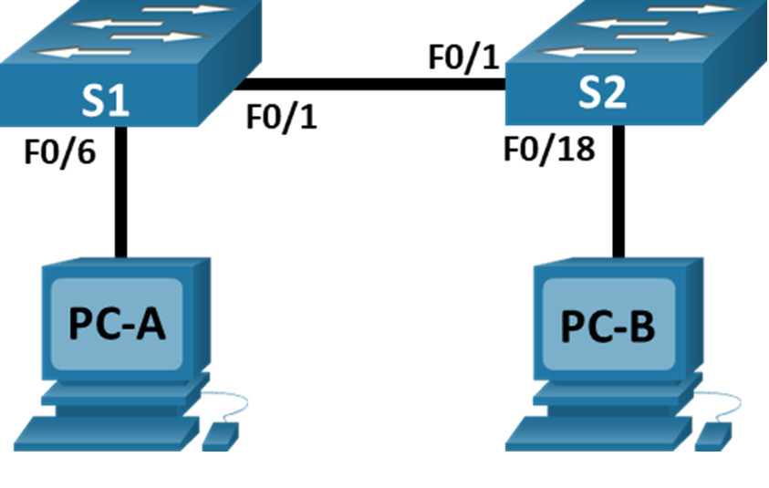
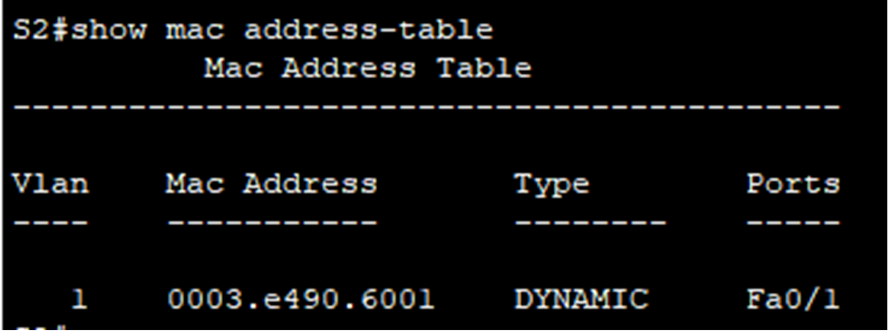
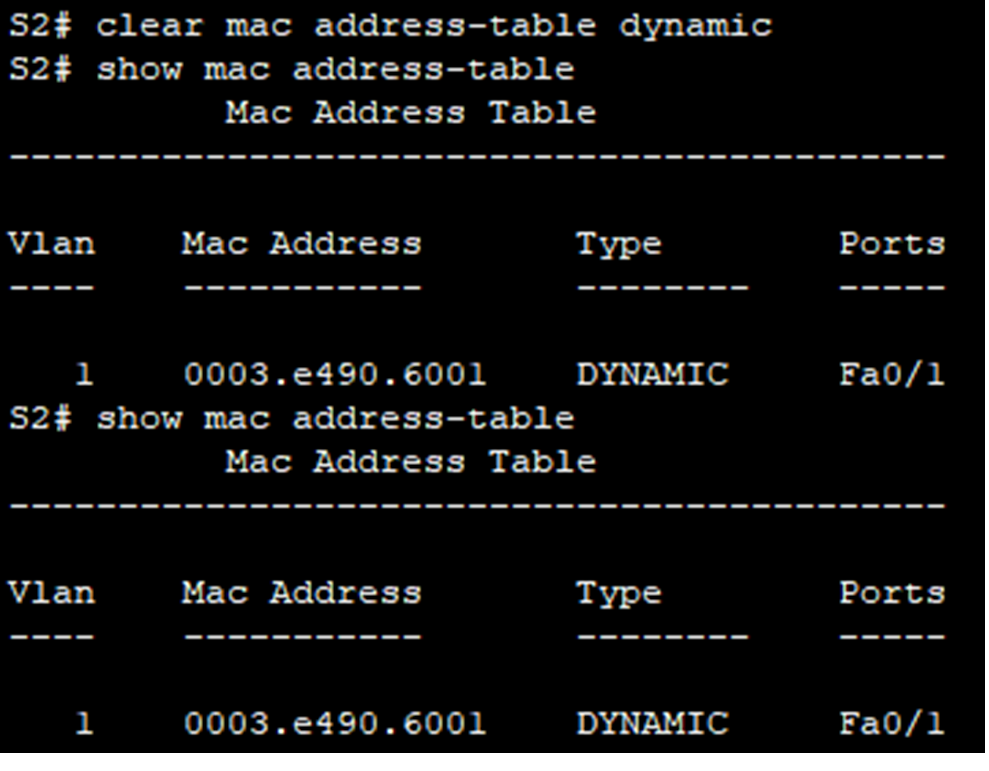
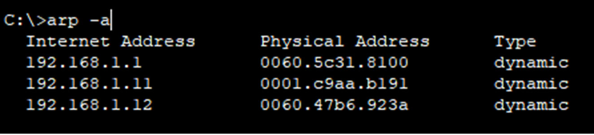
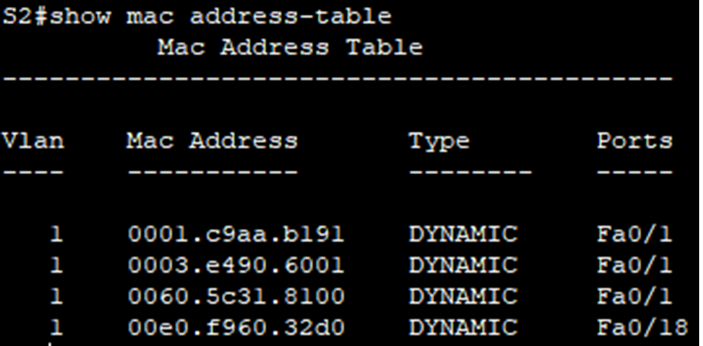
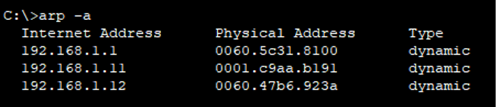

#  Просмотр таблицы MAC-адресов коммутатора 

###  Топология:

###  Исходные данные:

| Устройство       | Интерфейс      | IP-адрес / префикс       |
|-----------------:|:---------------|-------------------------:|
| S1               | Vlan 1         | 192.168.1.11 /24         |
| S2               | Vlan 1         | 192.168.1.12 /24         |
| PC-A             | NIC            | 192.168.1.1 /24          |
| PC-B             | NIC            | 192.168.1.2 /24          |

### Цели

### Часть 1. Создание и настройка сети

### Часть 2. Изучение таблицы МАС-адресов коммутатора

###  Решение:

# Часть 1. Создание и настройка сети

### 1. Подключите сеть в соответствии с топологией.

### 2. Настройте узлы ПК.

### 3. Выполните инициализацию и перезагрузку коммутаторов.

### 4. Настройте базовые параметры каждого коммутатора.

a.	Настройте имена устройств в соответствии с топологией.

b.	Настройте IP-адреса, как указано в таблице адресации.

c.	Назначьте cisco в качестве паролей консоли и VTY.

d.	Назначьте class в качестве пароля доступа к привилегированному режиму EXEC.

# Часть 2. Изучение таблицы МАС-адресов коммутатора

### 1. Запишите МАС-адреса сетевых устройств.

a.	Откройте командную строку на PC-A и PC-B и введите команду ipconfig /all.

Назовите физические адреса адаптера Ethernet.

     MAC-адрес компьютера PC-A: 0060.5C31.8100
     
     MAC-адрес компьютера PC-B: 00E0.F960.32D0
     
b.	Подключитесь к коммутаторам S1 и S2 через консоль и введите команду show interface F0/1 на каждом коммутаторе.

Назовите адреса оборудования во второй строке выходных данных команды (или зашитый адрес — bia).
     
     МАС-адрес коммутатора S1 Fast Ethernet 0/1: 0003.e490.6001
     
     МАС-адрес коммутатора S2 Fast Ethernet 0/1: 0060.3e43.2c01

### 2. Просмотрите таблицу МАС-адресов коммутатора.

Подключитесь к коммутатору S2 через консоль и просмотрите таблицу МАС-адресов до и после тестирования сетевой связи с помощью эхо-запросов.

a.	Подключитесь к коммутатору S2 через консоль и войдите в привилегированный режим EXEC.

b.	В привилегированном режиме EXEC введите команду show mac address-table и нажмите клавишу ввода.

Записаны ли в таблице МАС-адресов какие-либо МАС-адреса? — да, записан MAC-адрес коммутатора S1

С какими портами коммутатора они сопоставлены и каким устройствам принадлежат? — порт Fa0/1 коммутатора S1.

### 3. Очистите таблицу МАС-адресов коммутатора S2 и снова отобразите таблицу МАС-адресов.

a.	В привилегированном режиме EXEC введите команду clear mac address-table dynamic и нажмите клавишу Enter.

S2# clear mac address-table dynamic

b.	Снова быстро введите команду show mac address-table.

Указаны ли в таблице МАС-адресов адреса для VLAN 1? Указаны ли другие МАС-адреса? - MAC-адрес коммутатора S1

Через 10 секунд введите команду show mac address-table и нажмите клавишу ввода. Появились ли в таблице МАС-адресов новые адреса? — нет, не появились

### 4. С компьютера PC-B отправьте эхо-запросы устройствам в сети и просмотрите таблицу МАС-адресов коммутатора.

a.	На компьютере PC-B откройте командную строку и еще раз введите команду arp -a.

Не считая адресов многоадресной и широковещательной рассылки, сколько пар IP- и МАС-адресов устройств было получено через протокол ARP? — 3 пары

b.	Из командной строки PC-B отправьте эхо-запросы на компьютер PC-A, а также коммутаторы S1 и S2.

От всех ли устройств получены ответы? - Ответы пришли от всех устройств

c.	Подключившись через консоль к коммутатору S2, введите команду show mac address-table.

Добавил ли коммутатор в таблицу МАС-адресов дополнительные МАС-адреса? Если да, то какие адреса и устройства? - Да, добавил: коммутатор S1, PC-A, PC-B

На компьютере PC-B откройте командную строку и еще раз введите команду arp -a.

Появились ли в ARP-кэше компьютера PC-B дополнительные записи для всех сетевых устройств, которым были отправлены эхо-запросы? — нет, таблица осталась прежней

# Ответы на вопросы для повторения

В сетях Ethernet данные передаются на устройства по соответствующим МАС-адресам. Для этого коммутаторы и компьютеры динамически создают ARP-кэш и таблицы МАС-адресов. Если компьютеров в сети немного, эта процедура выглядит достаточно простой. Какие сложности могут возникнуть в крупных сетях?

1) В крупных сетях может быть много MAC-адресов, и таблица может не иметь достаточно памяти. Это может привести к тому, что коммутатор не сможет создать динамическое соответствие между MAC-адресом и портом.
2) Если узлы долго не передают данные, соответствующие записи из таблицы удаляются.
3) Это может вызывать задержки в передаче данных. Переполнение ARP-кэша снижает производительность сети.

Файл лабораторной работы Cisco PT [здесь](lab2.pkt).
