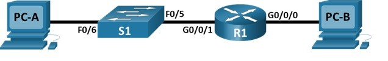

# Настройка IPv6-адресов на сетевых устройствах 

###  Топология:

###  Исходные данные:

| Устройство       | Интерфейс      | IPv6-адрес         | Link local IPv6-адрес  | Длина префикса | Шлюз по умолчанию |
|-----------------:|:---------------|--------------------|------------------------|----------------|-------------------|
| R1               | G0/0/0         | 2001:db8:acad:a::1 | fe80::1 | 64 | - |
|                  | G0/0/1         | 2001:db8:acad:1::1 | fe80::1 | 64 | - |
| S1               | VLAN 1         | 2001:db8:acad:1::b | fe80::b | 64 | - |
| PC-A             | NIC            | 2001:db8:acad:1::3 | SLACC | 64 | fe80::1 |
| PC-B             | NIC            | 2001:db8:acad:a::3 | SLACC | 64 | fe80::1 |

### Задачи

### Часть 1. Настройка топологии и конфигурация основных параметров маршрутизатора и коммутатора

### Часть 2. Ручная настройка IPv6-адресов

### Часть 3. Проверка сквозного соединения

###  Решение:

# Часть 1. Настройка топологии и конфигурация основных параметров маршрутизатора и коммутатора

### 1. Подключите сеть в соответствии с топологией.

### 2. Ручная настройка IPv6-адресов.

# Часть 2. Изучение таблицы МАС-адресов коммутатора

### 1. Запишите МАС-адреса сетевых устройств.

a.	Откройте командную строку на PC-A и PC-B и введите команду ipconfig /all.

### 2. Просмотрите таблицу МАС-адресов коммутатора.

Подключитесь к коммутатору S2 через консоль и просмотрите таблицу МАС-адресов до и после тестирования сетевой связи с помощью эхо-запросов.

a.	Подключитесь к коммутатору S2 через консоль и войдите в привилегированный режим EXEC.

b.	В привилегированном режиме EXEC введите команду show mac address-table и нажмите клавишу ввода.

Записаны ли в таблице МАС-адресов какие-либо МАС-адреса? — да, записан MAC-адрес коммутатора S1

С какими портами коммутатора они сопоставлены и каким устройствам принадлежат? — порт Fa0/1 коммутатора S1.

### 3. Очистите таблицу МАС-адресов коммутатора S2 и снова отобразите таблицу МАС-адресов.

a.	В привилегированном режиме EXEC введите команду clear mac address-table dynamic и нажмите клавишу Enter.

S2# clear mac address-table dynamic

b.	Снова быстро введите команду show mac address-table.

Указаны ли в таблице МАС-адресов адреса для VLAN 1? Указаны ли другие МАС-адреса? - MAC-адрес коммутатора S1

Через 10 секунд введите команду show mac address-table и нажмите клавишу ввода. Появились ли в таблице МАС-адресов новые адреса? — нет, не появились

### 4. С компьютера PC-B отправьте эхо-запросы устройствам в сети и просмотрите таблицу МАС-адресов коммутатора.

a.	На компьютере PC-B откройте командную строку и еще раз введите команду arp -a.

Не считая адресов многоадресной и широковещательной рассылки, сколько пар IP- и МАС-адресов устройств было получено через протокол ARP? — 3 пары

b.	Из командной строки PC-B отправьте эхо-запросы на компьютер PC-A, а также коммутаторы S1 и S2.

От всех ли устройств получены ответы? - Ответы пришли от всех устройств

c.	Подключившись через консоль к коммутатору S2, введите команду show mac address-table.

Добавил ли коммутатор в таблицу МАС-адресов дополнительные МАС-адреса? Если да, то какие адреса и устройства? - Да, добавил: коммутатор S1, PC-A, PC-B

На компьютере PC-B откройте командную строку и еще раз введите команду arp -a.

Появились ли в ARP-кэше компьютера PC-B дополнительные записи для всех сетевых устройств, которым были отправлены эхо-запросы? — нет, таблица осталась прежней

# Часть 3. Проверка сквозного подключения.

# Ответы на вопросы для повторения

В сетях Ethernet данные передаются на устройства по соответствующим МАС-адресам. Для этого коммутаторы и компьютеры динамически создают ARP-кэш и таблицы МАС-адресов. Если компьютеров в сети немного, эта процедура выглядит достаточно простой. Какие сложности могут возникнуть в крупных сетях?

1) В крупных сетях может быть много MAC-адресов, и таблица может не иметь достаточно памяти. Это может привести к тому, что коммутатор не сможет создать динамическое соответствие между MAC-адресом и портом.
2) Если узлы долго не передают данные, соответствующие записи из таблицы удаляются.
3) Это может вызывать задержки в передаче данных. Переполнение ARP-кэша снижает производительность сети.

Файл лабораторной работы Cisco PT [здесь](lab2.pkt).
