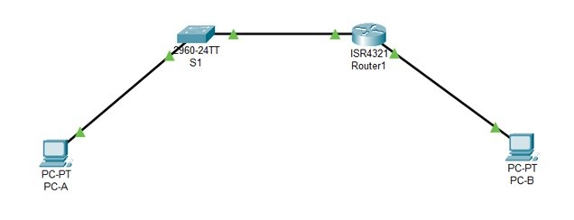
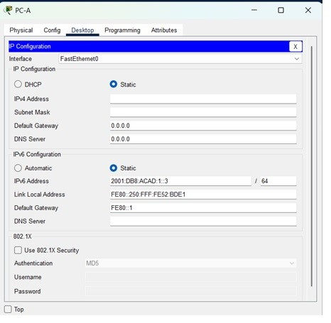
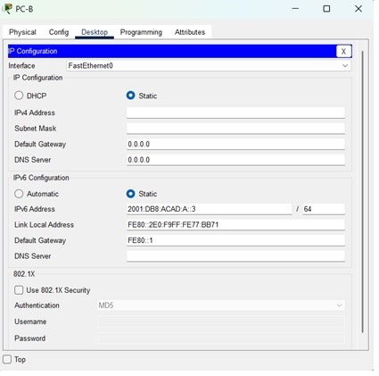

# Настройка IPv6-адресов на сетевых устройствах 

###  Топология:

###  Исходные данные:

| Устройство       | Интерфейс      | IPv6-адрес         | Link local IPv6-адрес  | Длина префикса | Шлюз по умолчанию |
|-----------------:|:---------------|--------------------|------------------------|----------------|-------------------|
| R1               | G0/0/0         | 2001:db8:acad:a::1 | fe80::1 | 64 | - |
|                  | G0/0/1         | 2001:db8:acad:1::1 | fe80::1 | 64 | - |
| S1               | VLAN 1         | 2001:db8:acad:1::b | fe80::b | 64 | - |
| PC-A             | NIC            | 2001:db8:acad:1::3 | SLACC | 64 | fe80::1 |
| PC-B             | NIC            | 2001:db8:acad:a::3 | SLACC | 64 | fe80::1 |

### Задачи

### Часть 1. Настройка топологии и конфигурация основных параметров маршрутизатора и коммутатора

### Часть 2. Ручная настройка IPv6-адресов

### Часть 3. Проверка сквозного соединения

###  Решение:

# Часть 1. Настройка топологии и конфигурация основных параметров маршрутизатора и коммутатора

	Подключите сеть в соответствии с топологией.

### Шаг 1. Настройте маршрутизатор.

	Назначьте имя хоста и настройте основные параметры устройства.

*no ip domain-lookup*

*hostname S1*

*service password-encryption*

*enable secret class*

*banner motd #Unauthorized access is strictly prohibited#*

### Шаг 2. Настройте коммутатор.

	Назначьте имя хоста и настройте основные параметры устройства.

*no ip domain-lookup*

*hostname R1*

*service password-encryption*

*enable secret class*

*banner motd #Unauthorized access is strictly prohibited#*

### 2. Ручная настройка IPv6-адресов.

### Шаг 1. Назначьте IPv6-адреса интерфейсам Ethernet на R1.

	a.	Назначьте глобальные индивидуальные IPv6-адреса, указанные в таблице адресации обоим интерфейсам Ethernet на R1.

	b.	Введите команду show ipv6 interface brief, чтобы проверить, назначен ли каждому интерфейсу корректный индивидуальный IPv6-адрес.

*R1#sh ipv6 interface brief*

*GigabitEthernet0/0/0 [up/down]*

*FE80::230:F2FF:FEE3:6B01*

*2001:DB8:ACAD:A::1*

*GigabitEthernet0/0/1 [up/down]*

*FE80::230:F2FF:FEE3:6B02*

*2001:DB8:ACAD:1::1*

*Vlan1 [administratively down/down]*

*unassigned*

	c.	Чтобы обеспечить соответствие локальных адресов канала индивидуальному адресу, вручную введите локальные адреса канала на каждом интерфейсе Ethernet на R1.

	d.	Используйте выбранную команду, чтобы убедиться, что локальный адрес связи изменен на fe80::1.  

*R1# show ipv6 interface brief*

*GigabitEthernet0/0/0 [up/up]*

*FE80::1* 
	
*2001:DB8:ACAD:A::1*

*GigabitEthernet0/0/1 [up/up]*

*FE80::1*
	
*2001:DB8:ACAD:1::1*

*Vlan1 [administratively down/down]*

*unassigned*

Ответ на вопрос: Какие группы многоадресной рассылки назначены интерфейсу G0/0?

*R1# sh ip interface gi 0/0/0*

*GigabitEthernet0/0/0 is up, line protocol is down (disabled)*

*Internet protocol processing disabled*

*- группы интерфейсу G0/0 неназначены*

### Шаг 2. Активируйте IPv6-маршрутизацию на R1.

	a.	В командной строке на PC-B введите команду ipconfig, чтобы получить данные IPv6-адреса, назначенного интерфейсу ПК.

*C:\>ipconfig

*FastEthernet0 Connection:(default port)

*Connection-specific DNS Suffix..:*

*Link-local IPv6 Address.........: ::*

*IPv6 Address....................: ::*

*IPv4 Address....................: 0.0.0.0*

*Subnet Mask.....................: 0.0.0.0*

*Default Gateway.................: ::*

*0.0.0.0*

*Bluetooth Connection:

*Connection-specific DNS Suffix..:*

*Link-local IPv6 Address.........: ::*

*IPv6 Address....................: ::*

*IPv4 Address....................: 0.0.0.0*

*Subnet Mask.....................: 0.0.0.0*

*Default Gateway.................: ::*

*0.0.0.0*

Ответн на вопрос: Назначен ли индивидуальный IPv6-адрес сетевой интерфейсной карте (NIC) на PC-B?

*-Нет, адрес неназначен*

*IPv6 Address....................: ::*

	b.	Активируйте IPv6-маршрутизацию на R1 с помощью команды IPv6 unicast-routing.

	c.	Теперь, когда R1 входит в группу многоадресной рассылки всех маршрутизаторов, еще раз введите команду ipconfig на PC-B. Проверьте данные IPv6-адреса.

*C:\>ipconfig*

*FastEthernet0 Connection:(default port)*

*Connection-specific DNS Suffix..:*

*Link-local IPv6 Address.........: FE80::2E0:F9FF:FE77:BB71*

*IPv6 Address....................: 2001:DB8:ACAD:A:2E0:F9FF:FE77:BB71*

*IPv4 Address....................: 0.0.0.0*

*Subnet Mask.....................: 0.0.0.0*

*Default Gateway.................: FE80::1*

*0.0.0.0*

*Bluetooth Connection:*

*Connection-specific DNS Suffix..: *

*Link-local IPv6 Address.........: ::*

*IPv6 Address....................: ::*

*IPv4 Address....................: 0.0.0.0*

*Subnet Mask.....................: 0.0.0.0*

*Default Gateway.................: ::*

*0.0.0.0*

Ответ на вопрос: Почему PC-B получил глобальный префикс маршрутизации и идентификатор подсети, которые вы настроили на R1?

*- На R1 все интерфейсы IPv6 теперь являются частью многоадресной группы All-router, FF02::2. Это позволяет маршрутизатору отправлять сообщения Router Advertisement (RA) с информацией о префиксе всем узлам в локальной сети* 

### Шаг 3. Назначьте IPv6-адреса интерфейсу управления (SVI) на S1.

	a.	Назначьте адрес IPv6 для S1. Также назначьте этому интерфейсу локальный адрес канала fe80::b.

	b.	Проверьте правильность назначения IPv6-адресов интерфейсу управления с помощью команды show ipv6 interface vlan1.

*S1# sh ipv6 interface vlan 1*

*Vlan1 is up, line protocol is up*

*IPv6 is enabled, link-local address is FE80::B*

*No Virtual link-local address(es):*

*Global unicast address(es):*

*2001:DB8:ACAD:1::B, subnet is 2001:DB8:ACAD:1::/64*

*Joined group address(es):*

*FF02::1*

*FF02::1:FF00:B*

*MTU is 1500 bytes*

*ICMP error messages limited to one every 100 milliseconds*

*ICMP redirects are enabled*

*ICMP unreachables are sent*

*Output features: Check hwidb*

*ND DAD is enabled, number of DAD attempts: 1*

*ND reachable time is 30000 milliseconds*

### Шаг 4. Назначьте компьютерам статические IPv6-адреса.

	a.	Откройте окно Свойства Ethernet для каждого ПК и назначьте адресацию IPv6.

Убедитесь, что оба компьютера имеют правильную информацию адреса IPv6

Примечание. При выполнении работы в среде Cisco Packet Tracer установите статический и SLACC адреса на компьютеры последовательно, отразив результаты в отчете

### Часть 3. Проверка сквозного подключения

#### С PC-A отправьте эхо-запрос на FE80::1. Это локальный адрес канала, назначенный G0/1 на R1.

*C:\>ping fe80::1*

*Pinging fe80::1 with 32 bytes of data:*

*Reply from FE80::1: bytes=32 time<1ms TTL=255*

*Reply from FE80::1: bytes=32 time<1ms TTL=255*

*Reply from FE80::1: bytes=32 time<1ms TTL=255*

*Reply from FE80::1: bytes=32 time<1ms TTL=255*

*Ping statistics for FE80::1:*

*Packets: Sent = 4, Received = 4, Lost = 0 (0% loss),*

*Approximate round trip times in milli-seconds:*

*Minimum = 0ms, Maximum = 0ms, Average = 0ms*

##### Отправьте эхо-запрос на интерфейс управления S1 с PC-A.

*C:\>ping fe80::b*

*Pinging fe80::b with 32 bytes of data:*

*Reply from FE80::B: bytes=32 time=2010ms TTL=255*

*Reply from FE80::B: bytes=32 time<1ms TTL=255*

*Reply from FE80::B: bytes=32 time<1ms TTL=255*

*Reply from FE80::B: bytes=32 time<1ms TTL=255*

*Ping statistics for FE80::B:*

*Packets: Sent = 4, Received = 4, Lost = 0 (0% loss),*

*Approximate round trip times in milli-seconds:*

*Minimum = 0ms, Maximum = 2010ms, Average = 502ms*

##### Введите команду tracert на PC-A, чтобы проверить наличие сквозного подключения к PC-B.

*C:\>tracert 2001:db8:acad:a::3*

*Tracing route to 2001:db8:acad:a::3 over a maximum of 30 hops:*

*1 0 ms 0 ms 0 ms 2001:DB8:ACAD:1::1*

*2 0 ms 0 ms 0 ms 2001:DB8:ACAD:A::3*

*Trace complete.*

#### С PC-B отправьте эхо-запрос на PC-A.

*C:\>ping 2001:db8:acad:1::3*

*Pinging 2001:db8:acad:1::3 with 32 bytes of data:*

*Reply from 2001:DB8:ACAD:1::3: bytes=32 time<1ms TTL=127*

*Reply from 2001:DB8:ACAD:1::3: bytes=32 time<1ms TTL=127*

*Reply from 2001:DB8:ACAD:1::3: bytes=32 time<1ms TTL=127*

*Reply from 2001:DB8:ACAD:1::3: bytes=32 time<1ms TTL=127*

*Ping statistics for 2001:DB8:ACAD:1::3:*

*Packets: Sent = 4, Received = 4, Lost = 0 (0% loss),*

*Approximate round trip times in milli-seconds:*

*Minimum = 0ms, Maximum = 0ms, Average = 0ms*

#### С PC-B отправьте эхо-запрос на локальный адрес канала G0/0 на R1.

*C:\>ping 2001:db8:acad:a::1*

*Pinging 2001:db8:acad:a::1 with 32 bytes of data:*

*Reply from 2001:DB8:ACAD:A::1: bytes=32 time=11ms TTL=255*

*Reply from 2001:DB8:ACAD:A::1: bytes=32 time<1ms TTL=255*

*Reply from 2001:DB8:ACAD:A::1: bytes=32 time<1ms TTL=255*

*Reply from 2001:DB8:ACAD:A::1: bytes=32 time=8ms TTL=255*

*Ping statistics for 2001:DB8:ACAD:A::1:*

*Packets: Sent = 4, Received = 4, Lost = 0 (0% loss),*

*Approximate round trip times in milli-seconds:*

*Minimum = 0ms, Maximum = 11ms, Average = 4ms*

# Ответы на вопросы для повторения

1.	Почему обоим интерфейсам Ethernet на R1 можно назначить один и тот же локальный адрес канала — FE80::1?

*- Link-local пакеты - пакеты локальный сети, поэтому один и тот же link-local адрес может использоваться на интерфейсе, связанном с другой локальной сетью*

2.	Какой идентификатор подсети в индивидуальном IPv6-адресе 2001:db8:acad::aaaa:1234/64?

*-0000 (следующие 16 бит); в сокращенной записи ::*

Файл лабораторной работы Cisco PT [здесь](lab4.pkt).
