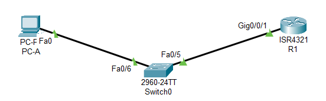
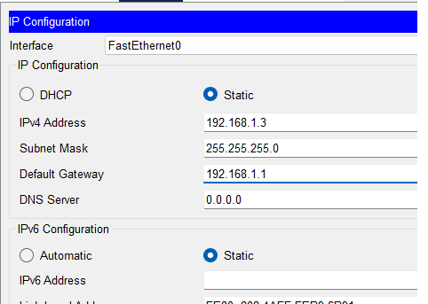
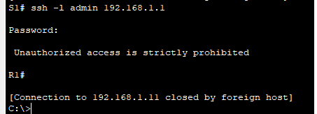
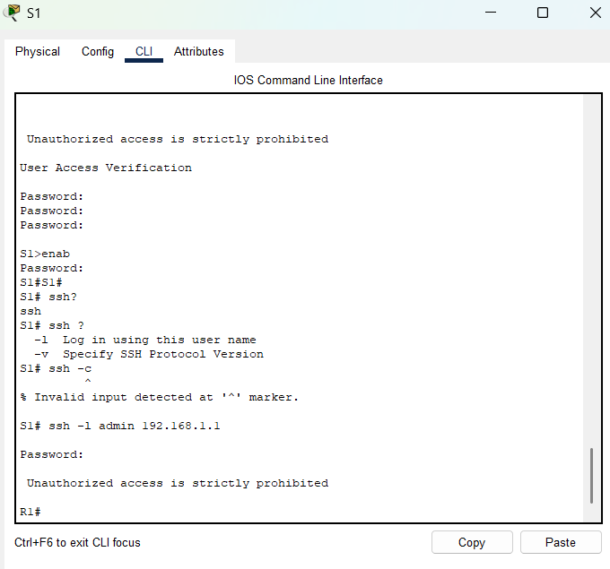

#  Доступ к сетевым устройствам по протоколу SSH

###  Задание:

Часть 1. Настройка основных параметров устройства

Часть 2. Настройка маршрутизатора для доступа по протоколу SSH

Часть 3. Настройка коммутатора для доступа по протоколу SSH

Часть 4. SSH через интерфейс командной строки (CLI) коммутатора

###  Исходные данные:

| Устройство       | Интерфейс      | IP-адрес / префикс       | Маска подсети | Шлюз по умолчанию |
|-----------------:|:---------------|-------------------------:|--------------:|-----------------:|
| R1               | G0/0/1        | 192.168.1.1          | 255.255.255.0 | - |
| S1               | Vlan 1         | 192.168.1.11          | 255.255.255.0 | 192.168.1.1 |
| PC-A             | NIC            | 192.168.1.3         | 255.255.255.0 | 192.168.1.1 |

###  Решение:

# Часть 1.Настройка основных параметров устройств

В части 1 потребуется настроить топологию сети и основные параметры, такие как IP-адреса интерфейсов, доступ к устройствам и пароли на маршрутизаторе.

###  1. Создайте сеть согласно топологии.

### 2. Выполните инициализацию и перезагрузку маршрутизатора и коммутатора.

### 3. Настройте маршрутизатор.

Откройте окно конфигурации
  a. Подключитесь к маршрутизатору с помощью консоли и активируйте привилегированный режим EXEC.
  
  b. Войдите в режим конфигурации.
  
  c. Отключите поиск DNS, чтобы предотвратить попытки маршрутизатора неверно преобразовывать введенные команды таким образом, как будто они являются именами узлов.

*no ip domain-lookup*

 d. Назначьте class в качестве зашифрованного пароля привилегированного режима EXEC.

*!*

*enable secret 5 $1$mERr$9cTjUIEqNGurQiFU.ZeCi1*

*!*

 e. Назначьте cisco в качестве пароля консоли и включите вход в систему по паролю.
 
 f. Назначьте cisco в качестве пароля VTY и включите вход в систему по паролю.
 
 g. Зашифруйте открытые пароли.

    *!*
  
    *line con 0*

    *password 7 0822455D0A16*

    *login*

    *!*

    *line aux 0*

    *!*

    *line vty 0 4*

    *password 7 0822455D0A16*

    *login*

    *line vty 5 15*

    *password 7 0822455D0A16*

    *login*

    *!*

 h. Создайте баннер, который предупреждает о запрете несанкционированного доступа.

    *banner motd ^C Unauthorized access is strictly prohibited ^C*

 i. Настройте и активируйте на маршрутизаторе интерфейс G0/0/1, используя информацию, приведенную в таблице адресации.

    *!*

    *interface GigabitEthernet0/0/1*

    *ip address 192.168.1.1 255.255.255.0*

    *duplex auto*

    *speed auto*

    *!*

 j. Сохраните текущую конфигурацию в файл загрузочной конфигурации.

    *R1#copy running-config startup-config*

    *Destination filename [startup-config]?*

    *Building configuration...*

    *[OK]*

### 4. Настройте компьютер PC-A.

 a. Настройте для PC-A IP-адрес и маску подсети.
 
 b. Настройте для PC-A шлюз по умолчанию.

### 5. Проверьте подключение к сети.

Пошлите с PC-A команду Ping на маршрутизатор R1. Если эхо-запрос с помощью команды ping не проходит, найдите и устраните неполадки подключения.

*C:\> ping 192.168.1.1*

*Pinging 192.168.1.1 with 32 bytes of data:*

*Reply from 192.168.1.1: bytes=32 time=28ms TTL=255*

*Reply from 192.168.1.1: bytes=32 time<1ms TTL=255*

*Reply from 192.168.1.1: bytes=32 time<1ms TTL=255*

*Reply from 192.168.1.1: bytes=32 time<1ms TTL=255*

*Ping statistics for 192.168.1.1:*

*Packets: Sent = 4, Received = 4, Lost = 0 (0% loss),*

*Approximate round trip times in milli-seconds:*

*Minimum = 0ms, Maximum = 28ms, Average = 7ms*

  # Часть 2. Настройка маршрутизатора для доступа по протоколу SSH

Подключение к сетевым устройствам по протоколу Telnet сопряжено с риском для безопасности, поскольку вся информация передается в виде открытого текста. Протокол SSH шифрует данные сеанса и обеспечивает аутентификацию устройств, поэтому для удаленных подключений рекомендуется использовать именно этот протокол. В части 2 вам нужно настроить маршрутизатор для приема соединений SSH по линиям VTY.
 
###  1. Настройте аутентификацию устройств.

При генерации ключа шифрования в качестве его части используются имя устройства и домен. Поэтому эти имена необходимо указать перед вводом команды crypto key.

Откройте окно конфигурации
  
  a. Задайте имя устройства.
  
  b. Задайте домен для устройства.
 
###  2. Создайте ключ шифрования с указанием его длины.

*R1(config)#ip domain-name otus.ru*

*R1(config)#crypto key generate rsa*

*The name for the keys will be: R1.otus.ru*

*Choose the size of the key modulus in the range of 360 to 2048 for your*

*General Purpose Keys. Choosing a key modulus greater than 512 may take*

*a few minutes.*

*How many bits in the modulus [512]: 2048*

*% Generating 2048 bit RSA keys, keys will be non-exportable...[ OK ]*

###  3. Создайте имя пользователя в локальной базе учетных записей.

Настройте имя пользователя, используя admin в качестве имени пользователя и Adm1nP @55 в качестве пароля.

*R1(config)#username admin privilege 15 secret Adm1nP@55*

###  4. Активируйте протокол SSH на линиях VTY.
  
  a. Активируйте протоколы Telnet и SSH на входящих линиях VTY с помощью команды transport input.
  
  b. Измените способ входа в систему таким образом, чтобы использовалась проверка пользователей по локальной базе учетных записей.

*R1(config)#line vty 0 4*

*R1(config-line)# transport input ssh*

*R1(config-line)#login local*

###  5. Сохраните текущую конфигурацию в файл загрузочной конфигурации.

###  6.  Установите соединение с маршрутизатором по протоколу SSH.

  a. Запустите Tera Term с PC-A.

  b. Установите SSH-подключение к R1. Use the username admin and password *Adm1nP@55*.
  У вас должно получиться установить SSH-подключение к R1.

*C:\> ssh -l admin 192.168.1.1*

*Password:* 

*Unauthorized access is strictly prohibited*

*R1#*

 # Часть 3. Настройка коммутатора для доступа по протоколу SSH
 
В части 3 вам предстоит настроить коммутатор для приема подключений по протоколу SSH, а затем установить SSH-подключение с помощью программы Tera Term.

###  1. Настройте основные параметры коммутатора.

Файл конфигурации коммутатора [здесь](config_S1.txt).

###  2. Настройте коммутатор для соединения по протоколу SSH.

Для настройки протокола SSH на коммутаторе используйте те же команды, которые применялись для аналогичной настройки маршрутизатора в части 2.

a. Настройте имя устройства, как указано в таблице адресации.

b. Задайте домен для устройства.

c. Создайте ключ шифрования с указанием его длины.

*S1(config)#ip domain-name otus.ru*

*S1(config)#crypto key generate rsa*

*The name for the keys will be: S1.otus.ru*

*Choose the size of the key modulus in the range of 360 to 2048 for your*

*General Purpose Keys. Choosing a key modulus greater than 512 may take*

*a few minutes.*

*How many bits in the modulus [512]: 2048*

*% Generating 2048 bit RSA keys, keys will be non-exportable...[OK]*

d. Создайте имя пользователя в локальной базе учетных записей.

e. Активируйте протоколы Telnet и SSH на линиях VTY.

f. Измените способ входа в систему таким образом, чтобы использовалась проверка пользователей по локальной базе учетных записей.

*S1(config)#ip domain-name otus.ru*

*S1(config)#crypto key generate rsa*

*The name for the keys will be: S1.otus.ru*

*Choose the size of the key modulus in the range of 360 to 2048 for your*

*General Purpose Keys. Choosing a key modulus greater than 512 may take*

*a few minutes.*

*How many bits in the modulus [512]: 2048*

*% Generating 2048 bit RSA keys, keys will be non-exportable...[OK]*

*S1(config)#ip ssh version 2*

*S1(config)#do sh ip ssh*

*SSH Enabled - version 2.0*

*Authentication timeout: 120 secs; Authentication retries: 3*

*S1(config)#username admin privilege 15 secret Adm1nP@55*

*S1(config)#line vty 0 4*

*S1(config-line)#transport input ssh*

*S1(config-line)#login local*

*S1# copy running-config startup-config*

*Destination filename [startup-config]?*

*Building configuration...*

*[OK]*

###  3. Установите соединение с коммутатором по протоколу SSH.

Запустите программу Tera Term на PC-A, затем установите подключение по протоколу SSH к интерфейсу SVI коммутатора S1.

*C:\> ssh -l admin 192.168.1.11*

*Password:*

*Unauthorized access is strictly prohibited*

*S1#*

 # Часть 4. Настройка протокола SSH с использованием интерфейса командной строки (CLI) коммутатора
 
Клиент SSH встроен в операционную систему Cisco IOS и может запускаться из интерфейса командной строки.

В части 4 вам предстоит установить соединение с маршрутизатором по протоколу SSH, используя интерфейс командной строки коммутатора.

###  1. Посмотрите доступные параметры для клиента SSH в Cisco IOS.

Откройте окно конфигурации

Используйте вопросительный знак (?), чтобы отобразить варианты параметров для команды ssh.

  
###  2. Установите с коммутатора S1 соединение с маршрутизатором R1 по протоколу SSH.

# Вопросы для повторения

1) Какие версии протокола SSH поддерживаются при использовании интерфейса командной строки?

*S1# ssh -v ?*

*1 Protocol Version 1*

*2 Protocol Version 2*

2) Как предоставить доступ к сетевому устройству нескольким пользователям, у каждого из которых есть собственное имя пользователя?

*Необходимо настроить доступ по SSH и создать несколько учетных записей (логин и пароль) для пользователей*

Файл лабораторной работы Cisco PT [здесь](lab5.pkt).

