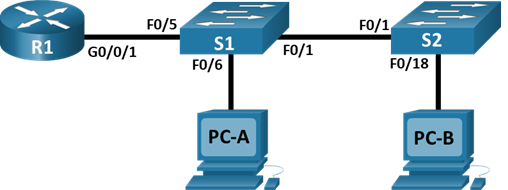
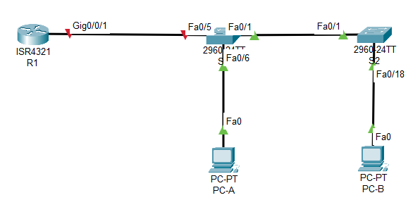
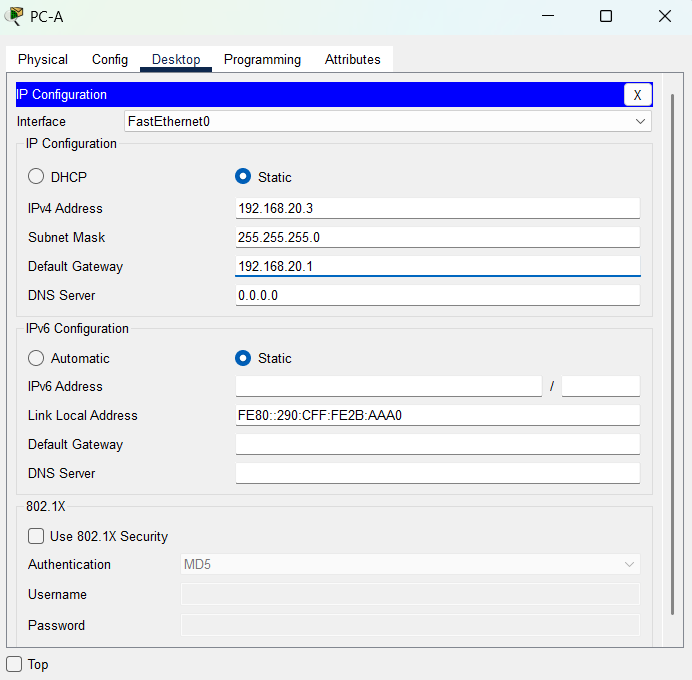
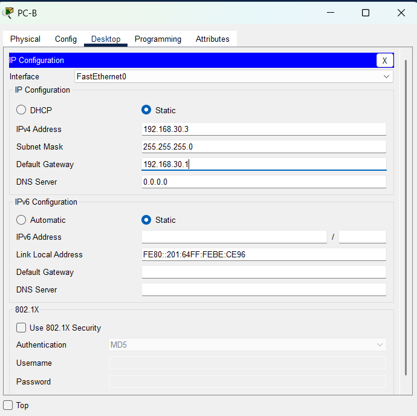
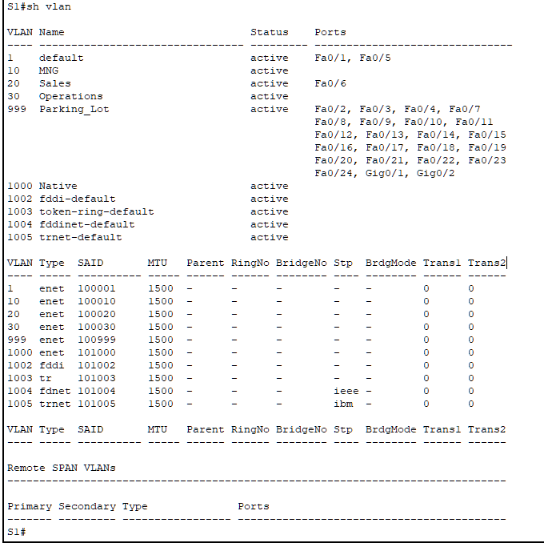
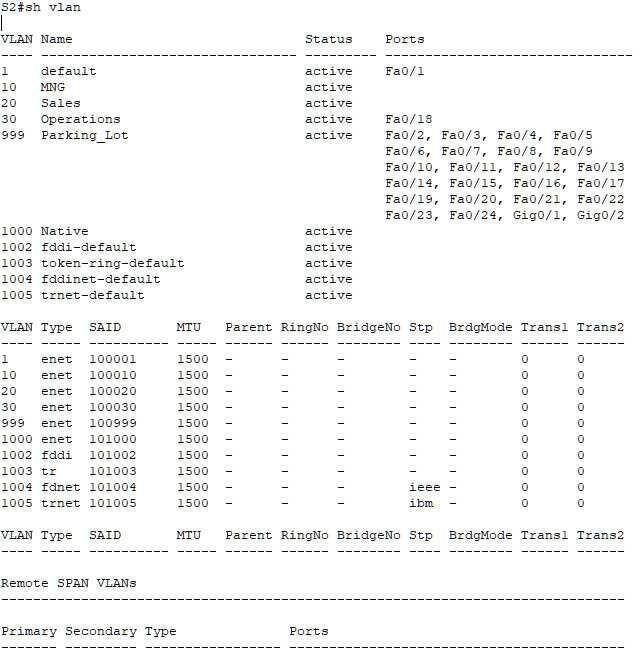
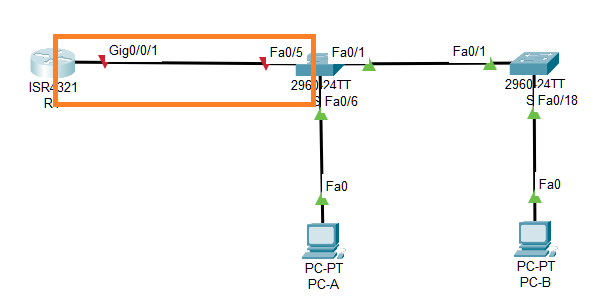
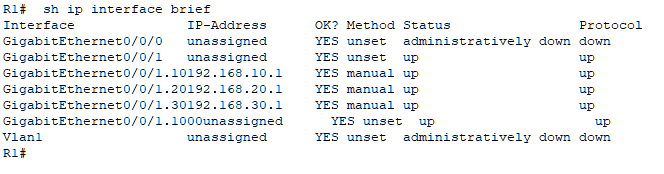
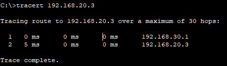

#  Внедрение маршрутизации между виртуальными локальными сетями



###  Задание:

Часть 1. Создание сети и настройка основных параметров устройства

Часть 2. Создание сетей VLAN и назначение портов коммутатора

Часть 3. Настройка транка 802.1Q между коммутаторами

Часть 4. Настройка маршрутизации между сетями VLAN

Часть 5. Проверка, что маршрутизация между VLAN работает

###  Исходные данные:

## Таблица адресации

| Устройство       | Интерфейс      | IP-адрес / префикс       | Маска подсети | Шлюз по умолчанию |
|:-----------------|:---------------|:-------------------------|:--------------|:-----------------|
| R1               | G0/0/1.10        | 192.168.10.1          | 255.255.255.0 | - |
| R1               | G0/0/1.20        | 192.168.20.1          | 255.255.255.0 | - |
| R1               | G0/0/1.30        | 192.168.30.1          | 255.255.255.0 | - |
| R1               | G0/0/1.1000        | -        | - | - |
| S1               | Vlan 10         | 192.168.10.11          | 255.255.255.0 | 192.168.10.1 |
| S2               | Vlan 01         | 192.168.10.12          | 255.255.255.0 | 192.168.10.1 |
| PC-A             | NIC            | 192.168.20.3         | 255.255.255.0 | 192.168.20.1 |
| PC-B             | NIC            | 192.168.30.3         | 255.255.255.0 | 192.168.30.1 |

## Таблица VLAN

| VLAN       | Имя      | Назначенный интерфейс |
|:-----------------|:---------------|:-------------------------|
| 10               | Управление        | S1: VLAN 1  S2: VLAN 10 |
| 20               | Sales       | S1: F0/6          |
| 30               | Operation      | S2: F0/18          |
| 999               | Parkind_Lot        |С1: F0/2-4, F0/7-24, G0/1-2  С2: F0/2-17, F0/19-24, G0/1-2         |
| 1000              | Собственная        | -        |

###  Решение:

# Часть 1.Создание сети и настройка основных параметров устройства

В первой части лабораторной работы вам предстоит создать топологию сети и настроить базовые параметры для узлов ПК и коммутаторов.

###  1. Создайте сеть согласно топологии.



### 2. Настройте базовые параметры для маршрутизатора.

    a. Подключитесь к маршрутизатору с помощью консоли и активируйте привилегированный режим EXEC.

Откройте окно конфигурации

    b. Войдите в режим конфигурации.
                
    c. Назначьте маршрутизатору имя устройства.
                
*hostname R1*

    d. Отключите поиск DNS, чтобы предотвратить попытки маршрутизатора неверно преобразовывать введенные команды таким образом, как будто они являются именами узлов.
                
*no ip domain-lookup*

    e. Назначьте class в качестве зашифрованного пароля привилегированного режима EXEC.

*enable secret class*

    f. Назначьте cisco в качестве пароля консоли и включите вход в систему по паролю.
                
*line console 0*

*password cisco*

    g. Установите cisco в качестве пароля виртуального терминала и активируйте вход.
    
*line vty 0 15*

*password cisco*

    h. Зашифруйте открытые пароли.
    
*service password-encryption*

    i. Создайте баннер с предупреждением о запрете несанкционированного доступа к устройству.

*banner motd 7 Unauthorized access is strictly prohibited 7*

    j. Сохраните текущую конфигурацию в файл загрузочной конфигурации.

*copy running-config startup-config*

    k. Настройте на маршрутизаторе время.
    
```
Router# clock set 14:30:00 23 Jan 2026
Router# configure terminal
Router(config)# clock timezone MSK 5
Router(config)# exit
```

### 3. Настройте базовые параметры каждого коммутатора.

Файлs конфигурации коммутатора [здесь](config_S1.txt) и [здесь](config_S2.txt)  

### 4. Настройте узлы ПК.





  # Часть 2. Создание сетей VLAN и назначение портов коммутатора

Во второй части вы создадите VLAN, как указано в таблице выше, на обоих коммутаторах. Затем вы назначите VLAN соответствующему интерфейсу и проверите настройки конфигурации. Выполните следующие задачи на каждом коммутаторе.
 
###  1. Создайте сети VLAN на коммутаторах.

    a. Создайте и назовите необходимые VLAN на каждом коммутаторе из таблицы выше.

```
10 MGN active 
20 Sales active 
30 Operations active 
999 Parking_Lot active 
1000 Native active
```


    b. Настройте интерфейс управления и шлюз по умолчанию на каждом коммутаторе, используя информацию об IP-адресе в таблице адресации.

```
S1(config)#interface vlan 10
S1(config-if)#ip address 192.168.10.11 255.255.255.0
S1(config-if)#no shutdown
S1(config-if)#exit
S1(config)#ip default-gateway 192.168.10.1
S1(config)#exit
```

```
S2(config)#interface vlan10
S2(config-if)#ip address 192.168.10.12 255.255.255.0
S2(config-if)#exit
S2(config)#ip default-gateway 192.168.10.1
S2(config)#exit
```

    c. Назначьте все неиспользуемые порты коммутатора VLAN Parking_Lot, настройте их для статического режима доступа и административно деактивируйте их.

```
S1(config)# interface range fa0/2-4, fa0/7-24, gi0/1-2
S1(config-if-range)# switchport mode access
S1(config-if-range)# switchport access vlan 999
S1(config-if-range)# shutdown
```

для коммутатора S2

```
S2(config)#interface range fa0/2-17, fa0/19-24, gi0/1-2
S2(config-if-range)#switchport mode access
S2(config-if-range)#switchport access vlan 999
S2(config-if-range)#shutdown
```
 
###  2. Назначьте сети VLAN соответствующим интерфейсам коммутатора.

    a. Назначьте используемые порты соответствующей VLAN (указанной в таблице VLAN выше) и настройте их для режима статического доступа.

```
S1(config)#interface fa0/6
S1(config-if)#switchport mode access
S1(config-if)#switchport access vlan 20
S1(config-if)#exit
```

для коммутатора S2

```
S2(config)#interface f0/18
S2(config-if)#switchport mode access
S2(config-if)#switchport access vlan 30
S2(config-if)#exit
```

b. Убедитесь, что VLAN назначены на правильные интерфейсы.





 # Часть 3. Конфигурация магистрального канала стандарта 802.1Q между коммутаторами
 
В части 3 вы вручную настроите интерфейс F0/1 как транк.

###  1. Вручную настройте магистральный интерфейс F0/1 на коммутаторах S1 и S2.

    a. Настройка статического транкинга на интерфейсе F0/1 для обоих коммутаторов.
    
    b. Установите native VLAN 1000 на обоих коммутаторах.
    
    c. Укажите, что VLAN 10, 20, 30 и 1000 могут проходить по транку.

    d. Проверьте транки, native VLAN и разрешенные VLAN через транк.

```
S1(config)#interface fa0/1
S1(config-if)#switchport mode trunk
S1(config-if)#switchport trunk native vlan 1000
S1(config-if)#switchport trunk allowed vlan 10,20,30,1000

S1(config)#do sh int trunk
Port Mode Encapsulation Status Native vlan
Fa0/1 on 802.1q trunking 1000
Port Vlans allowed on trunk
Fa0/1 10,20,30,1000
Port Vlans allowed and active in management domain
Fa0/1 10,20,30,1000
Port Vlans in spanning tree forwarding state and not pruned
Fa0/1 none
```

аналогично для S2

```
S2(config)# do sh int trunk
Port Mode Encapsulation Status Native vlan
Fa0/1 on 802.1q trunking 1000
Port Vlans allowed on trunk
Fa0/1 10,20,30,1000
Port Vlans allowed and active in management domain
Fa0/1 10,20,30,1000
Port Vlans in spanning tree forwarding state and not pruned
Fa0/1 none
```

###  2. Вручную настройте магистральный интерфейс F0/5 на коммутаторе S1.

    a. Настройте интерфейс S1 F0/5 с теми же параметрами транка, что и F0/1. Это транк до маршрутизатора.

```
S1(config)#interface fa0/5
S1(config-if)#switchport mode trunk
S1(config-if)#switchport trunk native vlan 1000
S1(config-if)#switchport trunk allowed vlan 10,20,30,1000
```
    b. Сохраните текущую конфигурацию в файл загрузочной конфигурации.
    
    c. Проверка транкинга.
    
```
S1# show interface trunk
Port Mode Encapsulation Status Native vlan
Fa0/1 on 802.1q trunking 1000
Fa0/5 on 802.1q trunking 1000

Port Vlans allowed on trunk
Fa0/1 10,20,30,1000
Fa0/5 10,20,30,1000

Port Vlans allowed and active in management domain
Fa0/1 10,20,30,1000
Fa0/5 10,20,30,1000

Port Vlans in spanning tree forwarding state and not pruned
Fa0/1 10,20,30,1000
Fa0/5 10,20,30,1000
```

Вопрос: Что произойдет, если G0/0/1 на R1 будет отключен? — *коммутатор не будет показывать что порт fa0/5 транковый, порт не поднимется*, смотрите рисунок 

 # Часть 4. Настройка маршрутизации между сетями VLAN

###  1. Настройте маршрутизатор.

    a. При необходимости активируйте интерфейс G0/0/1 на маршрутизаторе.
    
    b. Настройте подинтерфейсы для каждой VLAN, как указано в таблице IP-адресации. Все подинтерфейсы используют инкапсуляцию 802.1Q. Убедитесь, что подинтерфейсу для native VLAN не назначен IP-адрес. Включите описание для каждого подинтерфейса.

Пример части конфигурации

```
R1(config)#int gi0/0/1.30
R1(config-subif)#
R1(config-subif)#description Operations
R1(config-subif)#encapsulation dot1Q 30
R1(config-subif)#ip add 192.168.30.1 255.255.255.0
R1(config-subif)#exit
R1(config)#int gi0/0/1.1000
R1(config-subif)#
R1(config-subif)#description Native
R1(config-subif)#encapsulation dot1Q 1000
R1(config-subif)#exit
R1(config)#int gi0/0/1
R1(config-if)#description Trunk link to S1
R1(config-if)#no shut
R1(config-if)#exit
```

    c. Убедитесь, что вспомогательные интерфейсы работают

```
interface GigabitEthernet0/0/1
description Trunk link to S1
no ip address
duplex auto
speed auto
!
interface GigabitEthernet0/0/1.10
description MNG
encapsulation dot1Q 10
ip address 192.168.10.1 255.255.255.0
!
interface GigabitEthernet0/0/1.20
description Sales
encapsulation dot1Q 20
ip address 192.168.20.1 255.255.255.0
!
interface GigabitEthernet0/0/1.30
description Operations
encapsulation dot1Q 30
ip address 192.168.30.1 255.255.255.0
!
interface GigabitEthernet0/0/1.1000
description Native
encapsulation dot1Q 1000
no ip address.
```



 # Часть 5. Проверьте, работает ли маршрутизация между VLAN
 
###  1. Выполните следующие тесты с PC-A. Все должно быть успешно.

    a. Отправьте эхо-запрос с PC-A на шлюз по умолчанию.


    
    b. Отправьте эхо-запрос с PC-A на PC-B.


    
    c. Отправьте команду ping с компьютера PC-A на коммутатор S2.


###  2. Пройдите следующий тест с PC-B

В окне командной строки на PC-B выполните команду tracert на адрес PC-A.



Вопрос: Какие промежуточные IP-адреса отображаются в результатах? - *только адрес шлюза по умолчанию PC-B*

 # Приложение 

1) Итоговый конфиг коммутатора S1 [здесь](config_S1_all_end.txt).

2) Итоговый конфиг коммутатора S1 [здесь](config_S1_all_end.txt).

3) Итоговый конфиг маршрутизатора R1 [здесь](config_R1.txt).

4) Файл лабораторной работы Cisco PT [здесь](lab6.pkt).

