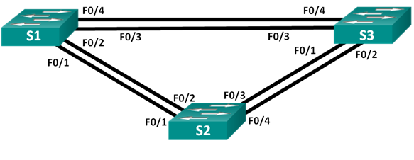
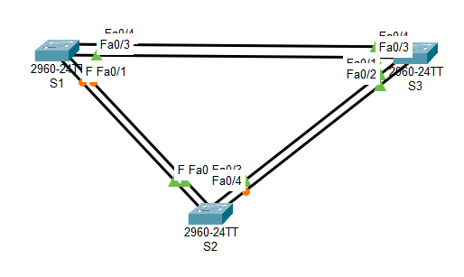

#  Развертывание коммутируемой сети с резервными каналами



###  Задание:

Часть 1. Создание сети и настройка основных параметров устройства

Часть 2. Выбор корневого моста

Часть 3. Наблюдение за процессом выбора протоколом STP порта, исходя из стоимости портов

Часть 4. Наблюдение за процессом выбора протоколом STP порта, исходя из приоритета портов

###  Исходные данные:

## Таблица адресации

| Устройство       | Интерфейс      | IP-адрес       | Маска подсети | 
|:-----------------|:---------------|:-------------------------|:--------------|
| S1               | VLAN 1        | 192.168.1.1          | 255.255.255.0 |
| S2               | VLAN 1         | 192.168.1.2          | 255.255.255.0 |
| S3               | VLAN 1         | 192.168.1.3          | 255.255.255.0 |


###  Решение:

# Часть 1. Создание сети и настройка основных параметров устройства

В первой части лабораторной работы вам предстоит создать топологию сети и настроить базовые параметры для узлов ПК и коммутаторов.

###  1. Создайте сеть согласно топологии.



### 2. Настройте базовые параметры для коммутатора.

    a. Отключите поиск DNS, чтобы предотвратить попытки маршрутизатора неверно преобразовывать введенные команды таким образом, как будто они являются именами узлов.
                
*no ip domain-lookup*
    
    b. Назначьте имена устройствам.
                
*hostname S1*
                
    c. Назначьте class в качестве зашифрованного пароля привилегированного режима EXEC.

*enable secret class*

    d. Назначьте cisco в качестве пароля консоли и включите вход в систему по паролю. Настройте logging synchronous для консольного канала
                
*line console 0*

*password cisco*

*logging synchronous*

    e. Установите cisco в качестве пароля виртуального терминала и активируйте вход.
    
*line vty 0 15*

*password cisco*

    f. Создайте баннер с предупреждением о запрете несанкционированного доступа к устройству.

*banner motd 7 Unauthorized access is strictly prohibited 7*

    g. Сохраните текущую конфигурацию в файл загрузочной конфигурации.

*copy running-config startup-config*

Файлы конфигурации коммутаторов [здесь](config_S1.txt) и [здесь](config_S2.txt) и [здесь](config_S3.txt)  

 ### 3. Проверьте связь.

Проверьте способность компьютеров обмениваться эхо-запросами.

*S1 ==PING==> [192.168.1.2] S2 S1 ==PING==> [192.168.1.3] S3 S2 ==PING==> [192.168.1.3] S3*

Успешно ли выполняется эхо-запрос от коммутатора S1 на коммутатор S2?	______________

Успешно ли выполняется эхо-запрос от коммутатора S1 на коммутатор S3?	______________

Успешно ли выполняется эхо-запрос от коммутатора S2 на коммутатор S3?	______________

Выполняйте отладку до тех пор, пока ответы на все вопросы не будут положительными.

# Часть 2. Определение корневого моста

### 1. Отключите все порты на коммутаторах.

*S(config)# interface range 'f0/0-3'*

### 2. Настройте подключенные порты в качестве транковых.

*S(config-if-range)# switchport mode trunk*

*S(config-if-range)# switchport trunk encapsulation dot1q*

### 3. Включите порты F0/2 и F0/4 на всех коммутаторах.

```
S1(config)# int r e0/0, e0/3
S1(config-if-range)# no sh
S2(config)# int r e0/0, e0/2
S2(config-if-range)# no sh
S3(config)# int r e0/0, e0/3
S3(config-if-range)# no sh*
```

### 4. Отобразите данные протокола spanning-tree.

Введите команду show spanning-tree на всех трех коммутаторах. Приоритет идентификатора моста рассчитывается путем сложения значений приоритета и расширенного идентификатора системы. Расширенным идентификатором системы всегда является номер сети VLAN. *В примере ниже все три коммутатора имеют равные значения приоритета идентификатора моста (32769 = 32768 + 1, где приоритет по умолчанию = 32768, номер сети VLAN = 1); следовательно, коммутатор с самым низким значением MAC-адреса становится корневым мостом (в примере — S2).*

*S1# show spanning-tree*


В схему ниже запишите роль и состояние (Sts) активных портов на каждом коммутаторе в топологии


С учетом выходных данных, поступающих с коммутаторов, ответьте на следующие вопросы.

Какой коммутатор является корневым мостом? ______________

Почему этот коммутатор был выбран протоколом spanning-tree в качестве корневого моста?
_______________________________________________________________________________________
_______________________________________________________________________________________

Какие порты на коммутаторе являются корневыми портами? ___________________________________

Какие порты на коммутаторе являются назначенными портами? ________________________________

Какой порт отображается в качестве альтернативного и в настоящее время заблокирован? ____________________________

Почему протокол spanning-tree выбрал этот порт в качестве невыделенного (заблокированного) порта?
_______________________________________________________________________________________
_______________________________________________________________________________________
_______________________________________________________________________________________
_______________________________________________________________________________________

# Часть 3. Наблюдение за процессом выбора протоколом STP порта, исходя из стоимости портов

### 1.Определите коммутатор с заблокированным портом.

При текущей конфигурации только один коммутатор может содержать заблокированный протоколом STP порт. Выполните команду show spanning-tree на обоих коммутаторах некорневого моста. *В примере ниже протокол spanning-tree блокирует порт F0/4 на коммутаторе с самым высоким идентификатором BID (S1).*

*S1# show spanning-tree*

### 2. Измените стоимость порта.

Помимо заблокированного порта, единственным активным портом на этом коммутаторе является порт, выделенный в качестве порта корневого моста. Уменьшите стоимость этого порта корневого моста до 18, выполнив команду spanning-tree vlan 1 cost 18 режима конфигурации интерфейса.

*S1(config)# interface f0/2*

*S1(config-if)# spanning-tree vlan 1 cost 18*

### 3. Просмотрите изменения протокола spanning-tree.

Повторно выполните команду show spanning-tree на обоих коммутаторах некорневого моста. Обратите внимание, что ранее заблокированный порт (S1 – F0/4) теперь является назначенным портом, и протокол spanning-tree теперь блокирует порт на другом коммутаторе некорневого моста (S3 – F0/4).

*S1# show spanning-tree*

*S3# show spanning-tree*

Почему протокол spanning-tree заменяет ранее заблокированный порт на назначенный порт и блокирует порт, который был назначенным портом на другом коммутаторе?
_______________________________________________________________________________________
_______________________________________________________________________________________

### 4. Удалите изменения стоимости порта.

    a.	Выполните команду no spanning-tree vlan 1 cost 18 режима конфигурации интерфейса, чтобы удалить запись стоимости, созданную ранее.

*S1(config)# interface f0/2*

*S1(config-if)# no spanning-tree vlan 1 cost 18*

    b.	Повторно выполните команду show spanning-tree, чтобы подтвердить, что протокол STP сбросил порт на коммутаторе некорневого моста, вернув исходные настройки порта. Протоколу STP требуется примерно 30 секунд, чтобы завершить процесс перевода порта.
    
# Часть 4. Наблюдение за процессом выбора протоколом STP порта, исходя из приоритета портов

Если стоимости портов равны, процесс сравнивает BID. Если BID равны, для определения корневого моста используются приоритеты портов. Значение приоритета по умолчанию — 128. STP объединяет приоритет порта с номером порта, чтобы разорвать связи. Наиболее низкие значения являются предпочтительными. В части 4 вам предстоит активировать избыточные пути до каждого из коммутаторов, чтобы просмотреть, каким образом протокол STP выбирает порт с учетом приоритета портов.

    a.	Включите порты F0/1 и F0/3 на всех коммутаторах.

    b.	Подождите 30 секунд, чтобы протокол STP завершил процесс перевода порта, после чего выполните команду show spanning-tree на коммутаторах некорневого моста. Обратите внимание, что порт корневого моста переместился на порт с меньшим номером, связанный с коммутатором корневого моста, и заблокировал предыдущий порт корневого моста.

*S1# show spanning-tree*

*S3# show spanning-tree*

Какой порт выбран протоколом STP в качестве порта корневого моста на каждом коммутаторе некорневого моста? _________________________________
Почему протокол STP выбрал эти порты в качестве портов корневого моста на этих коммутаторах?
_______________________________________________________________________________________
_______________________________________________________________________________________

# Вопросы для повторения
    
1.	Какое значение протокол STP использует первым после выбора корневого моста, чтобы определить выбор порта?

*Первым проверяется стоимость портов*

2.	Если первое значение на двух портах одинаково, какое следующее значение будет использовать протокол STP при выборе порта?

*Далее проверяется Bridge ID*

3.	Если оба значения на двух портах равны, каким будет следующее значение, которое использует протокол STP при выборе порта?

*Следующее значение для сравнения - приоритет порта (128 по умолчанию) и номер порта*


