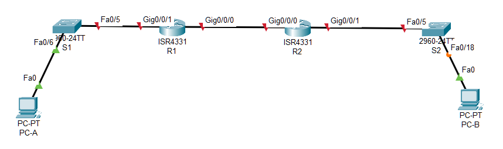
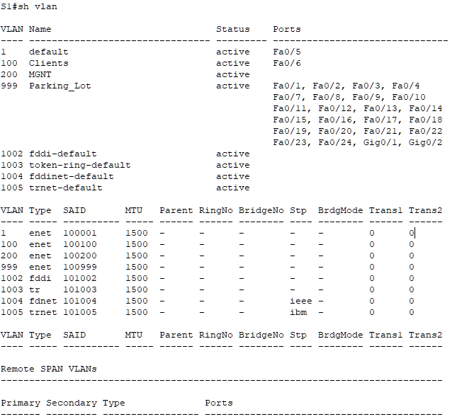
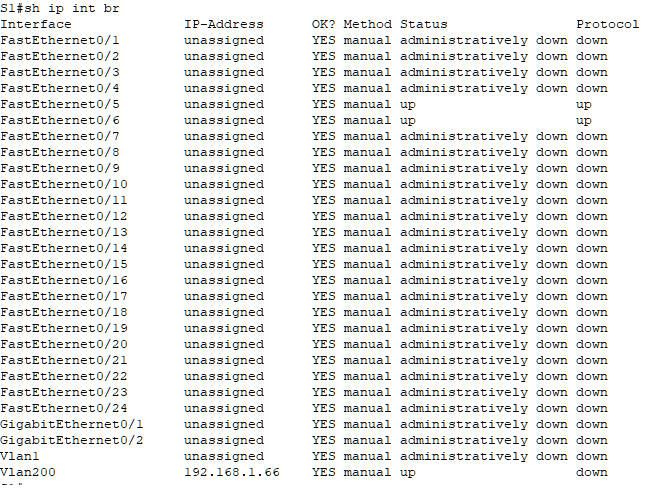
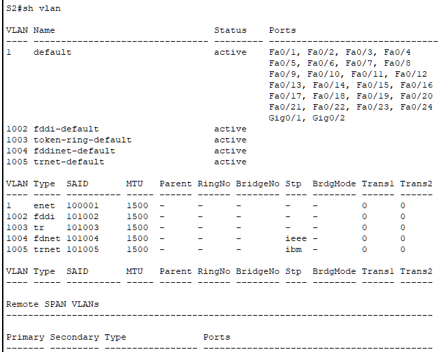
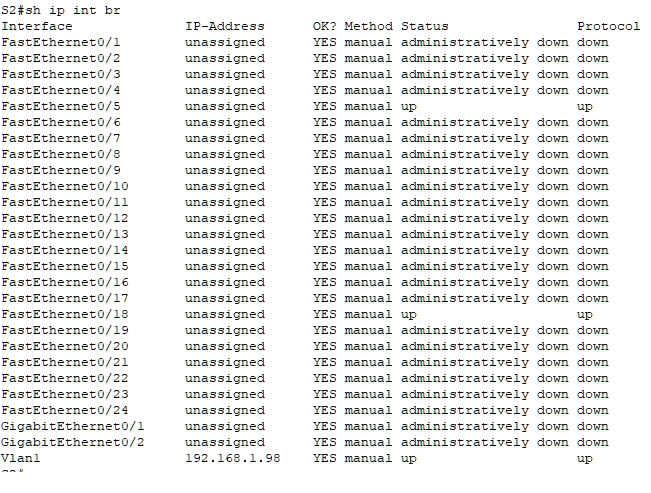

#  Реализация DHCPv4


###  Задание:

Часть 1. Создание сети и настройка основных параметров устройства

Часть 2. Настройка и проверка двух серверов DHCPv4 на R1

Часть 3. Настройка и проверка DHCP-ретрансляции на R2

###  Исходные данные:

## 1 Таблица адресации

| Устройство|	Интерфейс|	IP-адрес|	Маска подсети|	Шлюз по умолчанию|
|:----------|:----------|:----------|:----------|:----------|
|R1|	G0/0/0|	10.0.0.1|	255.255.255.252	|—|
|R1|	G0/0/1|	—	|—|	—|
|R1|	G0/0/1.100|	*192.168.1.1*	| *255.255.255.192* |	—|
|R1|	G0/0/1.200|*192.168.1.65*|*255.255.255.224*|	—|
|R1|	G0/0/1.1000|	—	|—|	—|
|R2|	G0/0	|10.0.0.2	|255.255.255.252|	—|
|R2|	G0/0/1|*192.168.1.97*|*255.255.255.240*|	—|		
|S1|	VLAN 200|*192.168.1.66*| *255.255.255.224*|	*192.168.1.65*|
|S2|	VLAN 1| *192.168.1.98*	|*255.255.255.240*|	*192.168.1.97*|
|PC-A|	NIC|	DHCP|	DHCP|	DHCP|
|PC-B|	NIC|	DHCP|	DHCP|	DHCP|

## 2 Таблица VLAN

|VLAN|	Имя	|Назначенный интерфейс|
|:----------|:----------|:--------|
|1|	Нет|	S2: F0/18|
|100|	Клиенты|	S1: F0/6| 
|200|	Управление|	S1: VLAN 200  |
|999|	Parking_Lot	|S1: F0/1-4, F0/7-24, G0/1-2|
|1000	|Собственная|	—|


###  Решение:

# Часть 1. Создание сети и настройка основных параметров устройства

В первой части лабораторной работы вам предстоит создать топологию сети и настроить базовые параметры для узлов ПК и коммутаторов.

###  1. Создание схемы адресации

Подсеть сети 192.168.1.0/24 в соответствии со следующими требованиями:

                a. Одна подсеть «Подсеть A», поддерживающая 58 хостов (клиентская VLAN на R1).
                
```
Подсеть A: 192.168.1.0 / 26
        ◦ диапазон хостов: 192.168.1.1 - 192.168.1.62
        ◦ маска сети: 255.255.255.192
        ◦ количество хостов: 62
```

Запишите первый IP-адрес в таблице адресации для R1 G0/0/1.100 . 
               
                b. Одна подсеть «Подсеть B», поддерживающая 28 хостов (управляющая VLAN на R1). 

```
Подсеть B: 192.168.1.64 / 27
        ◦ диапазон хостов: 192.168.1.65 - 192.168.1.94
        ◦ маска сети: 255.255.255.224
        ◦ количество хостов: 30
```

Запишите первый IP-адрес в таблице адресации для R1 G0/0/1.200. Запишите второй IP-адрес в таблице адресов для S1 VLAN 200 и введите соответствующий шлюз по умолчанию.

                c. Одна подсеть «Подсеть C», поддерживающая 12 узлов (клиентская сеть на R2).
                
```
Подсеть C: 192.168.1.96 / 28
        ◦ диапазон хостов: 192.168.1.97 - 192.168.1.110
        ◦ маска сети: 255.255.255.240
        ◦ количество хостов: 14
```

Запишите первый IP-адрес в таблице адресации для R2 G0/0/1.

###  2. Создайте сеть согласно топологии.



### 3. Произведите базовую настройку маршрутизаторов.

a. Назначьте маршрутизатору имя устройства.

b. Отключите поиск DNS, чтобы предотвратить попытки маршрутизатора неверно преобразовывать введенные команды таким образом, как будто они являются именами узлов.

c. Назначьте class в качестве зашифрованного пароля привилегированного режима EXEC.

d. Назначьте cisco в качестве пароля консоли и включите вход в систему по паролю.

e. Назначьте cisco в качестве пароля VTY и включите вход в систему по паролю.

f. Зашифруйте открытые пароли.

g. Создайте баннер с предупреждением о запрете несанкционированного доступа к устройству.

h. Сохраните текущую конфигурацию в файл загрузочной конфигурации.

i. Установите часы на маршрутизаторе на сегодняшнее время и дату.

### 4. Настройка маршрутизации между сетями VLAN на маршрутизаторе R1

a. Активируйте интерфейс G0/0/1 на маршрутизаторе.

b. Настройте подинтерфейсы для каждой VLAN в соответствии с требованиями таблицы IP-адресации. Все субинтерфейсы используют инкапсуляцию 802.1Q и назначаются первый полезный адрес из вычисленного пула IP-адресов. Убедитесь, что подинтерфейсу для native VLAN не назначен IP-адрес. Включите описание для каждого подинтерфейса.

```
R1(config)#int gi0/0/1.100
R1(config-subif)#
R1(config-subif)#description Clients
R1(config-subif)#encapsulation dot1Q 100
R1(config-subif)#ip add 192.168.1.1 255.255.255.192 
R1(config-subif)#exit

R1(config)#int gi0/0/1.200
R1(config-subif)#
R1(config-subif)#description MGNT
R1(config-subif)#encapsulation dot1Q 200
R1(config-subif)#ip add 192.168.1.65 255.255.255.224 
R1(config-subif)#exit

R1(config)#int gi0/0/1.1000
R1(config-subif)#
R1(config-subif)#description Native
R1(config-subif)#encapsulation dot1Q 1000 native
R1(config-subif)#exit

R1(config)#int gi0/0/1
R1(config-if)#description Trunk link to S1
R1(config-if)#no shut
R1(config-if)#exit
```
```
R1(config)#int g0/0/0
R1(config-if)#ip add 10.0.0.1 255.255.255.252
R1(config-if)#no shutdown
R1(config-if)#exit
R1(config)#ip route 0.0.0.0 0.0.0.0 10.0.0.2\
```

c. Убедитесь, что вспомогательные интерфейсы работают.

```
R1#sh ip int br
Interface              IP-Address      OK? Method Status                Protocol 
GigabitEthernet0/0/0   10.0.0.1        YES manual up                    down 
GigabitEthernet0/0/1   unassigned      YES unset  up                    up 
GigabitEthernet0/0/1.100192.168.1.1     YES manual up                    up 
GigabitEthernet0/0/1.200192.168.1.65    YES manual up                    up 
GigabitEthernet0/0/1.1000unassigned      YES unset  up                    up 
GigabitEthernet0/0/2   unassigned      YES unset  administratively down down 
Vlan1                  unassigned      YES unset  administratively down down
```

### 5. Настройте G0/1 на R2, затем G0/0/0 и статическую маршрутизацию для обоих маршрутизаторов

a. Настройте G0/0/1 на R2 с первым IP-адресом подсети C, рассчитанным ранее.

```
R2(config)#int g0/0/1
R2(config-if)#ip add 192.168.1.97 255.255.255.240
R2(config-if)#no shut
```

b. Настройте интерфейс G0/0/0 для каждого маршрутизатора на основе приведенной выше таблицы IP-адресации.

```
R2(config)#int g0/0/0
R2(config-if)#ip add 10.0.0.2 255.255.255.252
R2(config-if)#no shut
```

c. Настройте маршрут по умолчанию на каждом маршрутизаторе, указываемом на IP-адрес G0/0/0 на другом маршрутизаторе.

```
R2(config)# ip route 0.0.0.0 0.0.0.0 10.0.0.1
```

d. Убедитесь, что статическая маршрутизация работает с помощью пинга до адреса G0/0/1 R2 от R1.

```
R1#ping 10.0.0.2

Type escape sequence to abort.
Sending 5, 100-byte ICMP Echos to 10.0.0.2, timeout is 2 seconds:
!!!!!
Success rate is 100 percent (5/5), round-trip min/avg/max = 0/0/0 ms
```

e. Сохраните текущую конфигурацию в файл загрузочной конфигурации.

Файлы конфигурации  [здесь](config_R1.txt) и [здесь](config_R2.txt)

### 6. Настройте базовые параметры каждого коммутатора.

Файлы конфигурации  [здесь](config_S1.txt) и [здесь](config_S2.txt)

### 7. Создайте сети VLAN на коммутаторе S1.

a. Создайте необходимые VLAN на коммутаторе 1 и присвойте им имена из приведенной выше таблицы.

b. Настройте и активируйте интерфейс управления на S1 (VLAN 200), используя второй IP-адрес из подсети, рассчитанный ранее. Кроме того установите шлюз по умолчанию на S1.

c. Настройте и активируйте интерфейс управления на S2 (VLAN 1), используя второй IP-адрес из подсети, рассчитанный ранее. Кроме того, установите шлюз по умолчанию на S2

d. Назначьте все неиспользуемые порты S1 VLAN Parking_Lot, настройте их для статического режима доступа и административно деактивируйте их. На S2 административно деактивируйте все неиспользуемые порты.

### 8. Назначьте сети VLAN соответствующим интерфейсам коммутатора.

a. Назначьте используемые порты соответствующей VLAN (указанной в таблице VLAN выше) и настройте их для режима статического доступа.
Откройте окно конфигурации

b. Убедитесь, что VLAN назначены на правильные интерфейсы.









### Вопрос:

### Почему интерфейс F0/5 указан в VLAN 1? - *VLAN 1 это default VLAN. Он "приписывается" по умолчанию к каждому порту коммутатора*

### 9. Вручную настройте интерфейс S1 F0/5 в качестве транка 802.1Q.

a. Измените режим порта коммутатора, чтобы принудительно создать магистральный канал.

b. В рамках конфигурации транка  установите для native  VLAN значение 1000.

c. В качестве другой части конфигурации магистрали укажите, что VLAN 100, 200 и 1000 могут проходить по транку.

```
S1(config)#interface fa0/5
S1(config-if)#switchport mode trunk
S1(config-if)#switchport trunk native vlan 1000
S1(config-if)#switchport trunk allowed vlan 100,200,1000
```

d. Сохраните текущую конфигурацию в файл загрузочной конфигурации.

e. Проверьте состояние транка.

```
S1(config)#do sh int trunk
Port        Mode         Encapsulation  Status        Native vlan
Fa0/5       on           802.1q         trunking      1000

Port        Vlans allowed on trunk
Fa0/5       100,200,1000

Port        Vlans allowed and active in management domain
Fa0/5       100,200

Port        Vlans in spanning tree forwarding state and not pruned
Fa0/5       none
```

### Вопрос:

### Какой IP-адрес был бы у ПК, если бы он был подключен к сети с помощью DHCP?

```
C:\>ipconfig

FastEthernet0 Connection:(default port)

   Connection-specific DNS Suffix..: 
   Link-local IPv6 Address.........: ::
   IPv6 Address....................: ::
   Autoconfiguration IPv4 Address..: 169.254.42.26
   Subnet Mask.....................: 255.255.0.0
   Default Gateway.................: ::
                                     0.0.0.0
```

# Часть 2. Настройка и проверка двух серверов DHCPv4 на R1

В части 2 необходимо настроить и проверить сервер DHCPv4 на R1. Сервер DHCPv4 будет обслуживать две подсети, подсеть A и подсеть C.

### 1. Настройте R1 с пулами DHCPv4 для двух поддерживаемых подсетей. Ниже приведен только пул DHCP для подсети A

a. Исключите первые пять используемых адресов из каждого пула адресов.

b. Создайте пул DHCP (используйте уникальное имя для каждого пула).

c. Укажите сеть, поддерживающую этот DHCP-сервер.

d. В качестве имени домена укажите CCNA-lab.com.

e. Настройте соответствующий шлюз по умолчанию для каждого пула DHCP.

```
R1(config)#ip dhcp excluded-address 192.168.1.1 192.168.1.5
R1(config)# ip dhcp excluded-address 192.168.1.97 192.168.1.102
R1(config)#ip dhcp pool R1_Client_LAN
R1(dhcp-config)#network 192.168.1.0 255.255.255.192
R1(dhcp-config)#default-router 192.168.1.1
R1(dhcp-config)#domain-name CCNA-lab.com
```

f. Настройте время аренды на 2 дня 12 часов и 30 минут.

*не поддерживается CPT*

```
R1(dhcp-config)#lease 2 12 30
                ^
% Invalid input detected at '^' marker.

R1(dhcp-config)#?
  default-router  Default routers
  dns-server      Set name server
  domain-name     Domain name
  exit            Exit from DHCP pool configuration mode
  network         Network number and mask
  no              Negate a command or set its defaults
  option          Raw DHCP options
```

g. Затем настройте второй пул DHCPv4, используя имя пула R2_Client_LAN и вычислите сеть, маршрутизатор по умолчанию, и используйте то же имя домена и время аренды, что и предыдущий пул DHCP.

```
R1(config)# ip dhcp pool R2_Client_LAN
R1(dhcp-config)# network 192.168.1.96 255.255.255.240
R1(dhcp-config)# default-router 192.168.1.97
R1(dhcp-config)# domain-name CCNA-lab.com
```

### 2. Сохраните конфигурацию.

Сохраните текущую конфигурацию в файл загрузочной конфигурации.

```
R1#sh run | section dhcp
ip dhcp excluded-address 192.168.1.1 192.168.1.5
ip dhcp excluded-address 192.168.1.97 192.168.1.102
ip dhcp pool R1_Client_LAN
 network 192.168.1.0 255.255.255.192
 default-router 192.168.1.1
 domain-name CCNA-lab.com
ip dhcp pool R2_Client_LAN
 network 192.168.1.96 255.255.255.240
 default-router 192.168.1.97
 domain-name CCNA-lab.com
```

### 3. Проверка конфигурации сервера DHCPv4

a. Чтобы просмотреть сведения о пуле, выполните команду show ip dhcp pool

```
R1#show ip dhcp pool

Pool R1_Client_LAN :
 Utilization mark (high/low)    : 100 / 0
 Subnet size (first/next)       : 0 / 0 
 Total addresses                : 62
 Leased addresses               : 1
 Excluded addresses             : 2
 Pending event                  : none

 1 subnet is currently in the pool
 Current index        IP address range                    Leased/Excluded/Total
 192.168.1.1          192.168.1.1      - 192.168.1.62      1    / 2     / 62

Pool R2_Client_LAN :
 Utilization mark (high/low)    : 100 / 0
 Subnet size (first/next)       : 0 / 0 
 Total addresses                : 14
 Leased addresses               : 0
 Excluded addresses             : 2
 Pending event                  : none

 1 subnet is currently in the pool
 Current index        IP address range                    Leased/Excluded/Total
 192.168.1.97         192.168.1.97     - 192.168.1.110     0    / 2     / 14
```

b. Выполните команду show ip dhcp binding для проверки установленных назначений адресов DHCP.

```
R1#show ip dhcp binding
IP address       Client-ID/              Lease expiration        Type
                 Hardware address
192.168.1.6      00D0.D336.2A1A           --                     Automatic
```

c. Выполните команду show ip dhcp server statistics для проверки сообщений DHCP. - *не поддерживается CPT*

### 4. Попытка получить IP-адрес от DHCP на PC-A

a. Из командной строки компьютера PC-A выполните команду ipconfig /all.

```
C:\>ipconfig /all

FastEthernet0 Connection:(default port)

   Connection-specific DNS Suffix..: CCNA-lab.com
   Physical Address................: 00D0.D336.2A1A
   Link-local IPv6 Address.........: ::
   IPv6 Address....................: ::
   IPv4 Address....................: 192.168.1.6
   Subnet Mask.....................: 255.255.255.192
   Default Gateway.................: ::
                                     192.168.1.1
   DHCP Servers....................: 192.168.1.1
   DHCPv6 IAID.....................: 
   DHCPv6 Client DUID..............: 00-01-00-01-21-8B-04-93-00-D0-D3-36-2A-1A
   DNS Servers.....................: ::
                                     0.0.0.0

Bluetooth Connection:

   Connection-specific DNS Suffix..: CCNA-lab.com
   Physical Address................: 00D0.D307.87A6
   Link-local IPv6 Address.........: ::
   IPv6 Address....................: ::
   IPv4 Address....................: 0.0.0.0
   Subnet Mask.....................: 0.0.0.0
   Default Gateway.................: ::
                                     0.0.0.0
   DHCP Servers....................: 0.0.0.0
   DHCPv6 IAID.....................: 
   DHCPv6 Client DUID..............: 00-01-00-01-21-8B-04-93-00-D0-D3-36-2A-1A
   DNS Servers.....................: ::
                                     0.0.0.0
```

b. После завершения процесса обновления выполните команду ipconfig для просмотра новой информации об IP-адресе.

```
C:\>ipconfig

FastEthernet0 Connection:(default port)

   Connection-specific DNS Suffix..: CCNA-lab.com
   Link-local IPv6 Address.........: ::
   IPv6 Address....................: ::
   IPv4 Address....................: 192.168.1.6
   Subnet Mask.....................: 255.255.255.192
   Default Gateway.................: ::
                                     192.168.1.1

Bluetooth Connection:

   Connection-specific DNS Suffix..: CCNA-lab.com
   Link-local IPv6 Address.........: ::
   IPv6 Address....................: ::
   IPv4 Address....................: 0.0.0.0
   Subnet Mask.....................: 0.0.0.0
   Default Gateway.................: ::
                                     0.0.0.0
```

c. Проверьте подключение с помощью пинга IP-адреса интерфейса R0 G0/0/1.

```
C:\>ping 192.168.1.1

Pinging 192.168.1.1 with 32 bytes of data:

Reply from 192.168.1.1: bytes=32 time<1ms TTL=255
Reply from 192.168.1.1: bytes=32 time=1ms TTL=255
Reply from 192.168.1.1: bytes=32 time<1ms TTL=255
Reply from 192.168.1.1: bytes=32 time<1ms TTL=255

Ping statistics for 192.168.1.1:
    Packets: Sent = 4, Received = 4, Lost = 0 (0% loss),
Approximate round trip times in milli-seconds:
    Minimum = 0ms, Maximum = 1ms, Average = 0ms
```

# Часть 3. Настройка и проверка DHCP-ретрансляции на R2

В части 3 настраивается R2 для ретрансляции DHCP-запросов из локальной сети на интерфейсе G0/0/1 на DHCP-сервер (R1). 

### 1. Настройка R2 в качестве агента DHCP-ретрансляции для локальной сети на G0/0/1

a. Настройте команду ip helper-address на G0/0/1, указав IP-адрес G0/0/0 R1.

b. Сохраните конфигурацию.

```
R2# sh run | sec interface
interface GigabitEthernet0/0/0
 ip address 10.0.0.2 255.255.255.252
 duplex auto
 speed auto
interface GigabitEthernet0/0/1
 ip address 192.168.1.97 255.255.255.240
#### ip helper-address 10.0.0.1
 duplex auto
 speed auto
interface GigabitEthernet0/0/2
 no ip address
 duplex auto
 speed auto
 shutdown
interface Vlan1
 no ip address
 shutdown
```

### 2. Попытка получить IP-адрес от DHCP на PC-B

a. Из командной строки компьютера PC-B выполните команду ipconfig /all.

```
C:\>ipconfig /all

FastEthernet0 Connection:(default port)

   Connection-specific DNS Suffix..: CCNA-lab.com
   Physical Address................: 0030.F267.D242
   Link-local IPv6 Address.........: FE80::230:F2FF:FE67:D242
   IPv6 Address....................: ::
   IPv4 Address....................: 192.168.1.103
   Subnet Mask.....................: 255.255.255.240
   Default Gateway.................: ::
                                     192.168.1.97
   DHCP Servers....................: 10.0.0.1
   DHCPv6 IAID.....................: 
   DHCPv6 Client DUID..............: 00-01-00-01-7A-0D-12-16-00-30-F2-67-D2-42
   DNS Servers.....................: ::
                                     0.0.0.0

Bluetooth Connection:

   Connection-specific DNS Suffix..: CCNA-lab.com
   Physical Address................: 00D0.BAC0.85B6
   Link-local IPv6 Address.........: ::
   IPv6 Address....................: ::
   IPv4 Address....................: 0.0.0.0
   Subnet Mask.....................: 0.0.0.0
   Default Gateway.................: ::
                                     0.0.0.0
   DHCP Servers....................: 0.0.0.0
   DHCPv6 IAID.....................: 
   DHCPv6 Client DUID..............: 00-01-00-01-7A-0D-12-16-00-30-F2-67-D2-42
   DNS Servers.....................: ::
                                     0.0.0.0
```

b. После завершения процесса обновления выполните команду ipconfig для просмотра новой информации об IP-адресе.

c. Проверьте подключение с помощью пинга IP-адреса интерфейса R1 G0/0/1.

```
C:\>ping 192.168.1.1

Pinging 192.168.1.1 with 32 bytes of data:

Reply from 192.168.1.1: bytes=32 time<1ms TTL=254
Reply from 192.168.1.1: bytes=32 time<1ms TTL=254
Reply from 192.168.1.1: bytes=32 time<1ms TTL=254
Reply from 192.168.1.1: bytes=32 time<1ms TTL=254

Ping statistics for 192.168.1.1:
    Packets: Sent = 4, Received = 4, Lost = 0 (0% loss),
Approximate round trip times in milli-seconds:
    Minimum = 0ms, Maximum = 0ms, Average = 0ms
```

d. Выполните show ip dhcp binding для R1 для проверки назначений адресов в DHCP.

```
R1#show ip dhcp binding
IP address       Client-ID/              Lease expiration        Type
                 Hardware address
192.168.1.6      00D0.D336.2A1A           --                     Automatic
192.168.1.103    0030.F267.D242           --                     Automatic
```

e. Выполните команду show ip dhcp server statistics для проверки сообщений DHCP. - *команда не поддерживается CPT*

Файл лабораторной работы Cisco PT [здесь](lab8_DHCP_IPv4.pkt).

