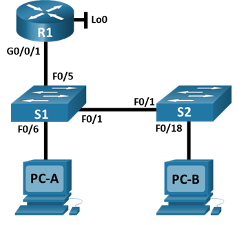
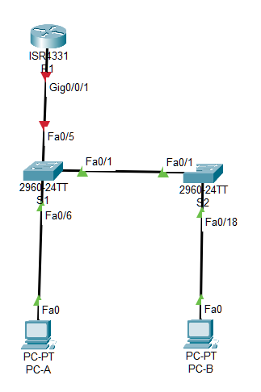

#  Конфигурация безопасности коммутатора



### Цели

### Часть 1. Настройка основного сетевого устройства

### Часть 2. Настройка сетей VLAN

### Часть 3. Настройки безопасности коммутатора

##  Исходные данные:

### Таблица адресации

| Устройство       | Интерфейс      | IP-адрес       | Маска подсети|
|:-----------------|:---------------|:--------------------|:-------|
| R1               | G0/0/1       | 192.168.10.1| 255.255.255.0|
|                  | Loopback 0       | 10.10.1.1| 255.255.255.0|
| S1               | VLAN 10       | 192.168.10.201| 255.255.255.0|
| S2               | VLAN 10       | 192.168.10.202| 255.255.255.0|
| PC-A              | NIC       | DHCP| 255.255.255.0|
| PC-B              | NIC       | DHCP| 255.255.255.0|

###  Решение:

# Часть 1. Настройка основного сетевого устройства

###  1. Создайте сеть согласно топологии.



### 2. Настройте маршрутизатор R1.

a. Загрузите следующий конфигурационный скрипт на R1.

Откройте окно конфигурации

```
enable
configure terminal
hostname R1
no ip domain lookup
ip dhcp excluded-address 192.168.10.1 192.168.10.9
ip dhcp excluded-address 192.168.10.201 192.168.10.202
ip dhcp relay information trust-all
!
ip dhcp pool Students
 network 192.168.10.0 255.255.255.0
 default-router 192.168.10.1
 domain-name CCNA2.Lab-11.6.1
!
interface Loopback0
 ip address 10.10.1.1 255.255.255.0
!
interface GigabitEthernet0/0/1
 description Link to S1
 ip address 192.168.10.1 255.255.255.0
 no shutdown
!
line con 0
 logging synchronous
 exec-timeout 0 0
```

b. Проверьте текущую конфигурацию на R1, используя следующую команду:

*R1# show ip interface brief*

```
Interface              IP-Address      OK? Method Status                Protocol 
GigabitEthernet0/0/0   unassigned      YES unset  administratively down down
GigabitEthernet0/0/1   192.168.10.1    YES manual up                    up
GigabitEthernet0/0/2   unassigned      YES unset  administratively down down 
Loopback0              10.10.1.1       YES manual up                    up 
Vlan1                  unassigned      YES unset  administratively down down
```

c. IP-адресация и интерфейсы находятся в состоянии up / up.

### 3. Настройка и проверка основных параметров коммутатора

a. Настройте имя хоста для коммутаторов S1 и S2.

b. Запретите нежелательный поиск в DNS.

c. Настройте описания интерфейса для портов, которые используются в S1 и S2.

d. Установите для шлюза по умолчанию для VLAN управления значение 192.168.10.1 на обоих коммутаторах.

# Часть 2. Настройка сетей VLAN на коммутаторах

### 1. Сконфигруриуйте VLAN 10

Добавьте VLAN 10 на S1 и S2 и назовите VLAN - Management.

### 2.  Сконфигруриуйте SVI для VLAN 10

Настройте IP-адрес в соответствии с таблицей адресации для SVI для VLAN 10 на S1 и S2. Включите интерфейсы SVI и предоставьте описание для интерфейса.

### 3.  Настройте VLAN 333 с именем Native на S1 и S2

### 4.  Настройте VLAN 999 с именем ParkingLot на S1 и S2

# Часть 3. Настройки безопасности коммутатора

### 1. Релизация магистральных соединений 802.1Q

a. Настройте все магистральные порты Fa0/1 на обоих коммутаторах для использования VLAN 333 в качестве native VLAN.

b. Убедитесь, что режим транкинга успешно настроен на всех коммутаторах.

*S1# show interface trunk*

```
Port Mode Encapsulation Status Native vlan
Fa0/1 on 802.1q trunking 333

Port Vlans allowed on trunk
Fa0/1 1-4094

Port Vlans allowed and active in management domain
Fa0/1 1,10,333,999

Port Vlans in spanning tree forwarding state and not pruned
Fa0/1 1,10,333,999
```

*S2# show interface trunk*

```
Port Mode Encapsulation Status Native vlan
Fa0/1 on 802.1q trunking 333

Port Vlans allowed on trunk
Fa0/1 1-4094

Port Vlans allowed and active in management domain
Fa0/1 1,10,333,999

Port Vlans in spanning tree forwarding state and not pruned
Fa0/1 1,10,333,999
```
c. Отключить согласование DTP F0/1 на S1 и S2.

d. Проверьте с помощью команды show interfaces.

S1# show interfaces f0/1 switchport | include Negotiation

Negotiation of Trunking: Off

S1# show interfaces f0/1 switchport | include Negotiation

Negotiation of Trunking: Off

### 2. Настройка портов доступа

a. На S1 настройте F0/5 и F0/6 в качестве портов доступа и свяжите их с VLAN 10.

b. На S2 настройте порт доступа Fa0/18 и свяжите его с VLAN 10.

### 3. Безопасность неиспользуемых портов коммутатора

a. На S1 и S2 переместите неиспользуемые порты из VLAN 1 в VLAN 999 и отключите неиспользуемые порты.

b. Убедитесь, что неиспользуемые порты отключены и связаны с VLAN 999, введя команду  show.

S1# show interfaces status

Port Name Status Vlan Duplex Speed Type
Fa0/1 Link to S2 connected trunk a-full a-100 10/100BaseTX
Fa0/2 disabled 999 auto auto 10/100BaseTX
Fa0/3 disabled 999 auto auto 10/100BaseTX
Fa0/4 disabled 999 auto auto 10/100BaseTX
Fa0/5 Link to R1 connected 10 a-full a-100 10/100BaseTX
Fa0/6 Link to PC-A connected 10 a-full a-100 10/100BaseTX
Fa0/7 disabled 999 auto auto 10/100BaseTX
Fa0/8 disabled 999 auto auto 10/100BaseTX
Fa0/9 disabled 999 auto auto 10/100BaseTX
Fa0/10 disabled 999 auto auto 10/100BaseTX
<output omitted>
S2# show interfaces status

Port Name Status Vlan Duplex Speed Type
Fa0/1 Link to S1 connected trunk a-full a-100 10/100BaseTX
Fa0/2 disabled 999 auto auto 10/100BaseTX
Fa0/3 disabled 999 auto auto 10/100BaseTX
<output omitted>
Fa0/14 disabled 999 auto auto 10/100BaseTX
Fa0/15 disabled 999 auto auto 10/100BaseTX
Fa0/16 disabled 999 auto auto 10/100BaseTX
Fa0/17 disabled 999 auto auto 10/100BaseTX
Fa0/18 Link to PC-B connected 10 a-full a-100 10/100BaseTX
Fa0/19 disabled 999 auto auto 10/100BaseTX
Fa0/20 disabled 999 auto auto 10/100BaseTX
Fa0/21 disabled 999 auto auto 10/100BaseTX
Fa0/22 disabled 999 auto auto 10/100BaseTX
Fa0/23 disabled 999 auto auto 10/100BaseTX
Fa0/24 disabled 999 auto auto 10/100BaseTX
Gi0/1 disabled 999 auto auto 10/100/1000BaseTX
Gi0/2 disabled 999 auto auto 10/100/1000BaseTX
    
# Часть 4. Документирование и реализация функций безопасности порта

Интерфейсы F0/6 на S1 и F0/18 на S2 настроены как порты доступа. На этом шаге вы также настроите безопасность портов на этих двух портах доступа.

a. На S1, введите команду show port-security interface f0/6  для отображения настроек по умолчанию безопасности порта для интерфейса F0/6. Запишите свои ответы ниже.

|Конфигурация безопасности порта по умолчанию||
|:------------------|:------------------|
| Функция | Настройка по умолчанию      |
|  Защита портов |        |
| Максимальное количество записей MAC-адресов |        |
| Режим проверки на нарушение безопасности |        |
| Aging Time |        |
| Aging Type |        |
| Secure Static Address Aging |        |
| Sticky MAC Address    |   |


# Часть 5. Настройка и проверка ретрансляции DHCPv6 на R2.

В части 5 необходимо настроить и проверить ретрансляцию DHCPv6 на R2, позволяя PC-B получать адрес IPv6.

### 1. Включите PC-B и проверьте адрес SLAAC, который он генерирует.

```
C:\>ipconfig /all

FastEthernet0 Connection:(default port)

   Connection-specific DNS Suffix..: 
   Physical Address................: 00D0.D334.4327
   Link-local IPv6 Address.........: FE80::1
   IPv6 Address....................: 2001:DB8:ACAD:3::1
   Autoconfiguration IP Address....: 169.254.67.39
   Subnet Mask.....................: 255.255.0.0
   Default Gateway.................: FE80::1
                                     0.0.0.0
   DHCP Servers....................: 0.0.0.0
   DHCPv6 IAID.....................: 
   DHCPv6 Client DUID..............: 00-01-00-01-06-21-35-51-00-D0-D3-34-43-27
   DNS Servers.....................: ::
                                     0.0.0.0
```

Обратите внимание на вывод, что используется префикс 2001:db8:acad:3::

### 2. Настройте R2 для предоставления DHCPv6 без состояния для PC-B.

a.	Настройте команду ipv6 dhcp relay на интерфейсе R2 G0/0/1, указав адрес назначения интерфейса G0/0/0 на R1. Также настройте команду managed-config-flag .

Откройте окно конфигурации

```
R2(config)#ipv6 dhcp pool R2-STATELESS
R2(config-dhcpv6)#dns-server 2001:db8:acad::254
R2(config-dhcpv6)#domain-name STATELESS.com
R2(config-dhcpv6)#ex
R2(config)#interface g0/0/1
R2(config-if)#ipv6 nd other-config-flag
R2(config-if)#ipv6 dhcp server R2-STATELESS

```

b.	Сохраните конфигурацию.

### 3. Попытка получить адрес IPv6 из DHCPv6 на PC-B.

a.	Перезапустите PC-B.

b.	Откройте командную строку на PC-B и выполните команду ipconfig /all и проверьте выходные данные, чтобы увидеть результаты операции ретрансляции DHCPv6.

```
C:\>ipconfig /all

FastEthernet0 Connection:(default port)

   Connection-specific DNS Suffix..: STATELESS.com 
   Physical Address................: 0002.4A4B.E764
   Link-local IPv6 Address.........: FE80::202:4AFF:FE4B:E764
   IPv6 Address....................: 2001:DB8:ACAD:3:202:4AFF:FE4B:E764
   Autoconfiguration IP Address....: 169.254.231.100
   Subnet Mask.....................: 255.255.0.0
   Default Gateway.................: FE80::1
                                     0.0.0.0
   DHCP Servers....................: 0.0.0.0
   DHCPv6 IAID.....................: 920517970
   DHCPv6 Client DUID..............: 00-01-00-01-D1-37-12-E3-00-02-4A-4B-E7-64
   DNS Servers.....................: 2001:DB8:ACAD::254
                                     0.0.0.0

Bluetooth Connection:

   Connection-specific DNS Suffix..: STATELESS.com 
   Physical Address................: 000A.41BC.A147
   Link-local IPv6 Address.........: ::
   IPv6 Address....................: ::
   IPv4 Address....................: 0.0.0.0
   Subnet Mask.....................: 0.0.0.0
   Default Gateway.................: ::
                                     0.0.0.0
   DHCP Servers....................: 0.0.0.0
   DHCPv6 IAID.....................: 920517970
   DHCPv6 Client DUID..............: 00-01-00-01-D1-37-12-E3-00-02-4A-4B-E7-64
   DNS Servers.....................: ::
                                     0.0.0.0

```
c.	Проверьте подключение с помощью пинга IP-адреса интерфейса R1 G0/0/1.

```
C:\>ping 2001:db8:acad:1::1

Pinging 2001:db8:acad:1::1 with 32 bytes of data:

Reply from 2001:DB8:ACAD:3::1: Destination host unreachable.
Reply from 2001:DB8:ACAD:3::1: Destination host unreachable.
Reply from 2001:DB8:ACAD:3::1: Destination host unreachable.
Reply from 2001:DB8:ACAD:3::1: Destination host unreachable.

Ping statistics for 2001:DB8:ACAD:1::1:
    Packets: Sent = 4, Received = 0, Lost = 4 (100% loss)
```


Файл лабораторной работы Cisco PT [здесь](lab8.pkt).


