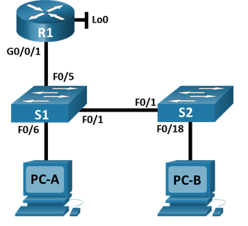
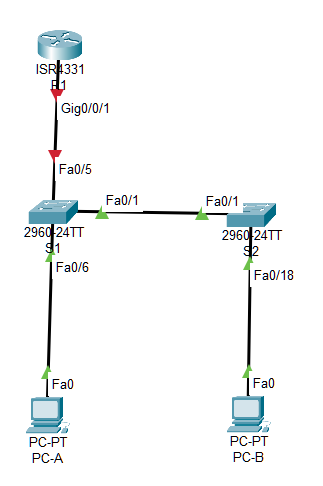

#  Конфигурация безопасности коммутатора



### Цели

### Часть 1. Настройка основного сетевого устройства

### Часть 2. Настройка сетей VLAN

### Часть 3. Настройки безопасности коммутатора

##  Исходные данные:

### Таблица адресации

| Устройство       | Интерфейс      | IP-адрес       | Маска подсети|
|:-----------------|:---------------|:--------------------|:-------|
| R1               | G0/0/1       | 192.168.10.1| 255.255.255.0|
|                  | Loopback 0       | 10.10.1.1| 255.255.255.0|
| S1               | VLAN 10       | 192.168.10.201| 255.255.255.0|
| S2               | VLAN 10       | 192.168.10.202| 255.255.255.0|
| PC-A              | NIC       | DHCP| 255.255.255.0|
| PC-B              | NIC       | DHCP| 255.255.255.0|

###  Решение:

# Часть 1. Настройка основного сетевого устройства

###  1. Создайте сеть согласно топологии.



### 2. Настройте маршрутизатор R1.

a. Загрузите следующий конфигурационный скрипт на R1.

Откройте окно конфигурации

```
enable
configure terminal
hostname R1
no ip domain lookup
ip dhcp excluded-address 192.168.10.1 192.168.10.9
ip dhcp excluded-address 192.168.10.201 192.168.10.202
ip dhcp relay information trust-all
!
ip dhcp pool Students
 network 192.168.10.0 255.255.255.0
 default-router 192.168.10.1
 domain-name CCNA2.Lab-11.6.1
!
interface Loopback0
 ip address 10.10.1.1 255.255.255.0
!
interface GigabitEthernet0/0/1
 description Link to S1
 ip address 192.168.10.1 255.255.255.0
 no shutdown
!
line con 0
 logging synchronous
 exec-timeout 0 0
```

b. Проверьте текущую конфигурацию на R1, используя следующую команду:

*R1# show ip interface brief*

```
Interface              IP-Address      OK? Method Status                Protocol 
GigabitEthernet0/0/0   unassigned      YES unset  administratively down down
GigabitEthernet0/0/1   192.168.10.1    YES manual up                    up
GigabitEthernet0/0/2   unassigned      YES unset  administratively down down 
Loopback0              10.10.1.1       YES manual up                    up 
Vlan1                  unassigned      YES unset  administratively down down
```

c. IP-адресация и интерфейсы находятся в состоянии up / up.

### 3. Настройка и проверка основных параметров коммутатора

a. Настройте имя хоста для коммутаторов S1 и S2.

b. Запретите нежелательный поиск в DNS.

c. Настройте описания интерфейса для портов, которые используются в S1 и S2.

d. Установите для шлюза по умолчанию для VLAN управления значение 192.168.10.1 на обоих коммутаторах.

#### for S1

```
!
interface Vlan10
 description MGMT
 ip address 192.168.10.201 255.255.255.0
!
ip default-gateway 192.168.10.1
!
```

#### for S2

```
!
interface Vlan10
 description MGMT
 ip address 192.168.10.202 255.255.255.0
!
ip default-gateway 192.168.10.1
!
```

# Часть 2. Настройка сетей VLAN на коммутаторах

### 1. Сконфигруриуйте VLAN 10

Добавьте VLAN 10 на S1 и S2 и назовите VLAN - Management.

### 2.  Сконфигруриуйте SVI для VLAN 10

Настройте IP-адрес в соответствии с таблицей адресации для SVI для VLAN 10 на S1 и S2. Включите интерфейсы SVI и предоставьте описание для интерфейса.

### 3.  Настройте VLAN 333 с именем Native на S1 и S2

### 4.  Настройте VLAN 999 с именем ParkingLot на S1 и S2

```
S1#sh vlan

VLAN Name                             Status    Ports
---- -------------------------------- --------- -------------------------------
1    default                          active    Fa0/1, Fa0/2, Fa0/3, Fa0/4
                                                Fa0/5, Fa0/6, Fa0/7, Fa0/8
                                                Fa0/9, Fa0/10, Fa0/11, Fa0/12
                                                Fa0/13, Fa0/14, Fa0/15, Fa0/16
                                                Fa0/17, Fa0/18, Fa0/19, Fa0/20
                                                Fa0/21, Fa0/22, Fa0/23, Fa0/24
                                                Gig0/1, Gig0/2
10   Management                       active    
333  Native                           active    
999  ParkingLot                       active    
1002 fddi-default                     active    
1003 token-ring-default               active    
1004 fddinet-default                  active    
1005 trnet-default                    active    

VLAN Type  SAID       MTU   Parent RingNo BridgeNo Stp  BrdgMode Trans1 Trans2
---- ----- ---------- ----- ------ ------ -------- ---- -------- ------ ------
1    enet  100001     1500  -      -      -        -    -        0      0
10   enet  100010     1500  -      -      -        -    -        0      0
333  enet  100333     1500  -      -      -        -    -        0      0
999  enet  100999     1500  -      -      -        -    -        0      0
1002 fddi  101002     1500  -      -      -        -    -        0      0   
1003 tr    101003     1500  -      -      -        -    -        0      0   
1004 fdnet 101004     1500  -      -      -        ieee -        0      0   
1005 trnet 101005     1500  -      -      -        ibm  -        0      0   

```

```
S2#sh vlan

VLAN Name                             Status    Ports
---- -------------------------------- --------- -------------------------------
1    default                          active    Fa0/1, Fa0/2, Fa0/3, Fa0/4
                                                Fa0/5, Fa0/6, Fa0/7, Fa0/8
                                                Fa0/9, Fa0/10, Fa0/11, Fa0/12
                                                Fa0/13, Fa0/14, Fa0/15, Fa0/16
                                                Fa0/17, Fa0/18, Fa0/19, Fa0/20
                                                Fa0/21, Fa0/22, Fa0/23, Fa0/24
                                                Gig0/1, Gig0/2
10   Management                       active    
333  Native                           active    
999  ParkingLot                       active    
1002 fddi-default                     active    
1003 token-ring-default               active    
1004 fddinet-default                  active    
1005 trnet-default                    active    

VLAN Type  SAID       MTU   Parent RingNo BridgeNo Stp  BrdgMode Trans1 Trans2
---- ----- ---------- ----- ------ ------ -------- ---- -------- ------ ------
1    enet  100001     1500  -      -      -        -    -        0      0
10   enet  100010     1500  -      -      -        -    -        0      0
333  enet  100333     1500  -      -      -        -    -        0      0
999  enet  100999     1500  -      -      -        -    -        0      0
1002 fddi  101002     1500  -      -      -        -    -        0      0   
1003 tr    101003     1500  -      -      -        -    -        0      0   
1004 fdnet 101004     1500  -      -      -        ieee -        0      0   
1005 trnet 101005     1500  -      -      -        ibm  -        0      0   
```

# Часть 3. Настройки безопасности коммутатора

### 1. Релизация магистральных соединений 802.1Q

a. Настройте все магистральные порты Fa0/1 на обоих коммутаторах для использования VLAN 333 в качестве native VLAN.

b. Убедитесь, что режим транкинга успешно настроен на всех коммутаторах.

```
S1#sh interface trunk
Port        Mode         Encapsulation  Status        Native vlan
Fa0/1       on           802.1q         trunking      333

Port        Vlans allowed on trunk
Fa0/1       1-1005

Port        Vlans allowed and active in management domain
Fa0/1       1,10,333,999

Port        Vlans in spanning tree forwarding state and not pruned
Fa0/1       10,999
```

```
S2#sh interface trunk
Port        Mode         Encapsulation  Status        Native vlan
Fa0/1       on           802.1q         trunking      333

Port        Vlans allowed on trunk
Fa0/1       1-1005

Port        Vlans allowed and active in management domain
Fa0/1       1,10,333,999

Port        Vlans in spanning tree forwarding state and not pruned
Fa0/1       1,10,333,999
```

c. Отключить согласование DTP F0/1 на S1 и S2.

d. Проверьте с помощью команды show interfaces.

```
S1(config)#int fa0/1
S1(config-if)#switchport nonegotiate

S1#sh int f0/1 switchport | i Negotiation
Negotiation of Trunking: Off
```

```
S2(config)#int fa0/1
S2(config-if)#switchport nonegotiate

S2#sh int f0/1 switchport | i Negotiation
Negotiation of Trunking: Off
```

### 2. Настройка портов доступа

a. На S1 настройте F0/5 и F0/6 в качестве портов доступа и свяжите их с VLAN 10.

```
S1(config)#int range f0/5,f0/6
S1(config-if-range)#switchport mode access
S1(config-if-range)#switchport access vlan 10
```

b. На S2 настройте порт доступа Fa0/18 и свяжите его с VLAN 10.

```
S2(config)#int f0/18
S2(config-if)#switchport mode access
S2(config-if)#switchport access vlan 10
```

### 3. Безопасность неиспользуемых портов коммутатора

a. На S1 и S2 переместите неиспользуемые порты из VLAN 1 в VLAN 999 и отключите неиспользуемые порты.

b. Убедитесь, что неиспользуемые порты отключены и связаны с VLAN 999, введя команду  show.

```
S1#sh int status
Port      Name               Status       Vlan       Duplex  Speed Type
Fa0/1                        connected    trunk      auto    auto  10/100BaseTX
Fa0/2                        disabled 999        auto    auto  10/100BaseTX
Fa0/3                        disabled 999        auto    auto  10/100BaseTX
Fa0/4                        disabled 999        auto    auto  10/100BaseTX
Fa0/5                        connected    10         auto    auto  10/100BaseTX
Fa0/6                        connected    10         auto    auto  10/100BaseTX
Fa0/7                        disabled 999        auto    auto  10/100BaseTX
...
Gig0/2                       disabled 999        auto    auto  10/100BaseTX
```

S2# show interfaces status

```
S2#sh int status
Port      Name               Status       Vlan       Duplex  Speed Type
Fa0/1                        connected    trunk      auto    auto  10/100BaseTX
Fa0/2                        disabled 999        auto    auto  10/100BaseTX
...
Fa0/17                       disabled 999        auto    auto  10/100BaseTX
Fa0/18                       connected    10         auto    auto  10/100BaseTX
Fa0/19                       disabled 999        auto    auto  10/100BaseTX
...
Gig0/2                       disabled 999        auto    auto  10/100BaseTX
```
    
# 4. Документирование и реализация функций безопасности порта

Интерфейсы F0/6 на S1 и F0/18 на S2 настроены как порты доступа. На этом шаге вы также настроите безопасность портов на этих двух портах доступа.

a. На S1, введите команду show port-security interface f0/6  для отображения настроек по умолчанию безопасности порта для интерфейса F0/6. Запишите свои ответы ниже.

|Конфигурация безопасности порта по умолчанию||
|:------------------|:------------------|
| Функция | Настройка по умолчанию      |
|  Защита портов |    *Disabled*    |
| Максимальное количество записей MAC-адресов |  *1*      |
| Режим проверки на нарушение безопасности |  *Shutdown*      |
| Aging Time |   *0 mins*    |
| Aging Type |    *Absolute*    |
| Secure Static Address Aging |     *Disabled*   |
| Sticky MAC Address    |  *Disabled* |

b. На S1 включите защиту порта на F0 / 6 со следующими настройками:
    
    • Максимальное количество записей MAC-адресов: 3
    
    • Режим безопасности: restrict
    
    • Aging time: 60 мин.
    
    • Aging type: неактивный

```
S1(config)#int f0/6
S1(config-if)# switchport port-secur max 3
S1(config-if)# switchport port-secur violat restrict
S1(config-if)# switchport port-secur aging time 60
S1(config-if)# switchport port-secur *aging type* ? - *не поддерживается CPT*
% Unrecognized command
S1(config-if)# switchport port-secur aging ?
  time  Port-security aging time
S1(config-if)# switchport port-secur
```

c. Verify port security on S1 F0/6.

```
S1# show port-secu int f0/6
Port Security              : Enabled
Port Status                : Secure-up
Violation Mode             : Restrict
Aging Time                 : 60 mins
Aging Type                 : Absolute
SecureStatic Address Aging : Disabled
Maximum MAC Addresses      : 3
Total MAC Addresses        : 1
Configured MAC Addresses   : 0
Sticky MAC Addresses       : 0
Last Source Address:Vlan   : 00D0.D33B.CCC3:10
Security Violation Count   : 0
```

```
S1#show port-security address
               Secure Mac Address Table
-----------------------------------------------------------------------------
Vlan    Mac Address       Type                          Ports   Remaining Age
                                                                   (mins)
----    -----------       ----                          -----   -------------
10	00D0.D33B.CCC3	DynamicConfigured	FastEthernet0/6		-
-----------------------------------------------------------------------------
Total Addresses in System (excluding one mac per port)     : 0
Max Addresses limit in System (excluding one mac per port) : 1024
```

d. Включите безопасность порта для F0 / 18 на S2. Настройте каждый активный порт доступа таким образом, чтобы он автоматически добавлял адреса МАС, изученные на этом порту, в текущую конфигурацию.

e. Настройте следующие параметры безопасности порта на S2 F / 18:
    
    • Максимальное количество записей MAC-адресов: 2
    
    • Тип безопасности: Protect
    
    • Aging time: 60 мин.
    
f. Проверка функции безопасности портов на S2 F0/18.

```
S2#show port-security address
               Secure Mac Address Table
-----------------------------------------------------------------------------
Vlan    Mac Address       Type                          Ports   Remaining Age
                                                                   (mins)
----    -----------       ----                          -----   -------------
10	0001.6347.9397	DynamicConfigured	FastEthernet0/18		-
-----------------------------------------------------------------------------
Total Addresses in System (excluding one mac per port)     : 0
Max Addresses limit in System (excluding one mac per port) : 1024
```

```
S2#show port-security interface f0/18
Port Security              : Enabled
Port Status                : Secure-up
Violation Mode             : Protect
Aging Time                 : 60 mins
Aging Type                 : Absolute
SecureStatic Address Aging : Disabled
Maximum MAC Addresses      : 2
Total MAC Addresses        : 1
Configured MAC Addresses   : 0
Sticky MAC Addresses       : 0
Last Source Address:Vlan   : 0001.6347.9397:10
Security Violation Count   : 0
```

### 5. Реализовать безопасность DHCP snooping.

a. На S2 включите DHCP snooping и настройте DHCP snooping во VLAN 10.

b. Настройте магистральные порты на S2 как доверенные порты.

c. Ограничьте ненадежный порт Fa0/18 на S2 пятью DHCP-пакетами в секунду.

```
S2(config)#ip dhcp snooping
S2(config)#ip dhcp snooping vlan 10
S2(config)#int f0/1
S2(config-if)#ip dhcp snooping trust
S2(config-if)#ex
S2(config)#int f0/18
S2(config-if)#ip dhcp snooping limit rate 5
S2(config-if)#exit
```

d. Проверка DHCP Snooping на S2.

```
S2#sh ip dhcp snooping
Switch DHCP snooping is enabled
DHCP snooping is configured on following VLANs:
10
Insertion of option 82 is disabled
Option 82 on untrusted port is not allowed
Verification of hwaddr field is enabled
Interface                  Trusted    Rate limit (pps)
-----------------------    -------    ----------------
FastEthernet0/1            yes        unlimited       
FastEthernet0/18           no         5               
```

e. В командной строке на PC-B освободите, а затем обновите IP-адрес.

C:\Users\Student> ipconfig /release
C:\Users\Student> ipconfig /renew

```
C:\>ipconfig /renew

   IP Address......................: 192.168.10.11
   Subnet Mask.....................: 255.255.255.0
   Default Gateway.................: 192.168.10.1
   DNS Server......................: 0.0.0.0
```

f. Проверьте привязку отслеживания DHCP с помощью команды show ip dhcp snooping binding.

```
S2#sh ip dhcp snooping binding
MacAddress          IpAddress        Lease(sec)  Type           VLAN  Interface
------------------  ---------------  ----------  -------------  ----  -----------------
00:01:63:47:93:97   192.168.10.11    0           dhcp-snooping  10    FastEthernet0/18
Total number of bindings: 1
```

### 6. Реализация PortFast и BPDU Guard

a. Настройте PortFast на всех портах доступа, которые используются на обоих коммутаторах.

```
S1(config)#spanning-tree portfast default
S1(config)#int range f0/6,f0/5
S1(config-if-range)#spanning-tree portfast disable
```

b. Включите защиту BPDU на портах доступа VLAN 10 S1 и S2, подключенных к PC-A и PC-B.

```
S1(config)#int f0/6
S1(config-if)#spanning-tree bpduguard enable
```

c. Убедитесь, что защита BPDU и PortFast включены на соответствующих портах.

```
S1#sh spanning-tree summary
Switch is in pvst mode
Root bridge for: default Management Native ParkingLot
Extended system ID           is enabled
Portfast Default             is enabled
PortFast BPDU Guard Default  is disabled
Portfast BPDU Filter Default is disabled
Loopguard Default            is disabled
EtherChannel misconfig guard is disabled
UplinkFast                   is disabled
BackboneFast                 is disabled
Configured Pathcost method used is short

Name                   Blocking Listening Learning Forwarding STP Active
---------------------- -------- --------- -------- ---------- ----------
VLAN0001                     0         0        0          1          1
VLAN0010                     0         0        0          3          3
VLAN0333                     0         0        0          1          1
VLAN0999                     0         0        0          1          1

---------------------- -------- --------- -------- ---------- ----------
4 vlans                      0         0        0          6          6
```

```
S1# sh span int f0/6 detail

Port 6 (FastEthernet0/6) of VLAN0010 is designated forwarding
  Port path cost 19, Port priority 128, Port Identifier 128.6
  Designated root has priority 32778, address 0000.0C1A.3D29
  Designated bridge has priority 32778, address 0000.0C1A.3D29
  Designated port id is 128.6, designated path cost 19
  Timers: message age 16, forward delay 0, hold 0
  Number of transitions to forwarding state: 1
  Link type is point-to-point by default
```

#### for S2

```
S2(config)#spanning-tree portfast default
S2(config)#int f0/18
S2(config-if)#spanning-tree portfast disable
S2(config-if)#spanning-tree bpduguard enable
```

```
S2# sh spanning-tree summary
Switch is in pvst mode
Root bridge for:
Extended system ID           is enabled
Portfast Default             is enabled
PortFast BPDU Guard Default  is disabled
Portfast BPDU Filter Default is disabled
Loopguard Default            is disabled
EtherChannel misconfig guard is disabled
UplinkFast                   is disabled
BackboneFast                 is disabled
Configured Pathcost method used is short

Name                   Blocking Listening Learning Forwarding STP Active
---------------------- -------- --------- -------- ---------- ----------
VLAN0001                     0         0        0          1          1
VLAN0010                     0         0        0          2          2
VLAN0333                     0         0        0          1          1
VLAN0999                     0         0        0          1          1

---------------------- -------- --------- -------- ---------- ----------
4 vlans                      0         0        0          5          5
```

```
S2# sh span int f0/18 detail

Port 18 (FastEthernet0/18) of VLAN0010 is designated forwarding
  Port path cost 19, Port priority 128, Port Identifier 128.18
  Designated root has priority 32778, address 0000.0C1A.3D29
  Designated bridge has priority 32778, address 0060.2F53.AD41
  Designated port id is 128.18, designated path cost 19
  Timers: message age 16, forward delay 0, hold 0
  Number of transitions to forwarding state: 1
  Link type is point-to-point by default
```

### 7. Проверьте наличие сквозного подключения.

Проверьте PING свзяь между всеми устройствами в таблице IP-адресации. В случае сбоя проверки связи может потребоваться отключить брандмауэр на хостах.

#### for PC-A
```
C:\>ping 192.168.10.1

Pinging 192.168.10.1 with 32 bytes of data:

Reply from 192.168.10.1: bytes=32 time<1ms TTL=255
Reply from 192.168.10.1: bytes=32 time<1ms TTL=255
Reply from 192.168.10.1: bytes=32 time<1ms TTL=255
Reply from 192.168.10.1: bytes=32 time<1ms TTL=255

Ping statistics for 192.168.10.1:
    Packets: Sent = 4, Received = 4, Lost = 0 (0% loss),
Approximate round trip times in milli-seconds:
    Minimum = 0ms, Maximum = 0ms, Average = 0ms

C:\>ping 192.168.10.11

Pinging 192.168.10.11 with 32 bytes of data:

Reply from 192.168.10.11: bytes=32 time<1ms TTL=128
Reply from 192.168.10.11: bytes=32 time=7ms TTL=128
Reply from 192.168.10.11: bytes=32 time<1ms TTL=128
Reply from 192.168.10.11: bytes=32 time<1ms TTL=128

Ping statistics for 192.168.10.11:
    Packets: Sent = 4, Received = 4, Lost = 0 (0% loss),
Approximate round trip times in milli-seconds:
    Minimum = 0ms, Maximum = 7ms, Average = 1ms

C:\>ping 192.168.10.201

Pinging 192.168.10.201 with 32 bytes of data:

Reply from 192.168.10.201: bytes=32 time<1ms TTL=255
Reply from 192.168.10.201: bytes=32 time<1ms TTL=255
Reply from 192.168.10.201: bytes=32 time<1ms TTL=255
Reply from 192.168.10.201: bytes=32 time<1ms TTL=255

Ping statistics for 192.168.10.201:
    Packets: Sent = 4, Received = 4, Lost = 0 (0% loss),
Approximate round trip times in milli-seconds:
    Minimum = 0ms, Maximum = 0ms, Average = 0ms

C:\>ping 192.168.10.202

Pinging 192.168.10.202 with 32 bytes of data:

Reply from 192.168.10.202: bytes=32 time<1ms TTL=255
Reply from 192.168.10.202: bytes=32 time=7ms TTL=255
Reply from 192.168.10.202: bytes=32 time<1ms TTL=255
Reply from 192.168.10.202: bytes=32 time<1ms TTL=255

Ping statistics for 192.168.10.202:
    Packets: Sent = 4, Received = 4, Lost = 0 (0% loss),
Approximate round trip times in milli-seconds:
    Minimum = 0ms, Maximum = 7ms, Average = 1ms
```

#### for PC-B

```
C:\> ping 192.168.10.1

Pinging 192.168.10.1 with 32 bytes of data:

Reply from 192.168.10.1: bytes=32 time<1ms TTL=255
Reply from 192.168.10.1: bytes=32 time<1ms TTL=255
Reply from 192.168.10.1: bytes=32 time<1ms TTL=255
Reply from 192.168.10.1: bytes=32 time<1ms TTL=255

Ping statistics for 192.168.10.1:
    Packets: Sent = 4, Received = 4, Lost = 0 (0% loss),
Approximate round trip times in milli-seconds:
    Minimum = 0ms, Maximum = 0ms, Average = 0ms

C:\> ping 192.168.10.201

Pinging 192.168.10.201 with 32 bytes of data:

Reply from 192.168.10.201: bytes=32 time<1ms TTL=255
Reply from 192.168.10.201: bytes=32 time<1ms TTL=255
Reply from 192.168.10.201: bytes=32 time<1ms TTL=255
Reply from 192.168.10.201: bytes=32 time<1ms TTL=255

Ping statistics for 192.168.10.201:
    Packets: Sent = 4, Received = 4, Lost = 0 (0% loss),
Approximate round trip times in milli-seconds:
    Minimum = 0ms, Maximum = 0ms, Average = 0ms

C:\> ping 192.168.10.10

Pinging 192.168.10.10 with 32 bytes of data:

Reply from 192.168.10.10: bytes=32 time<1ms TTL=128
Reply from 192.168.10.10: bytes=32 time<1ms TTL=128
Reply from 192.168.10.10: bytes=32 time<1ms TTL=128
Reply from 192.168.10.10: bytes=32 time<1ms TTL=128

Ping statistics for 192.168.10.10:
    Packets: Sent = 4, Received = 4, Lost = 0 (0% loss),
Approximate round trip times in milli-seconds:
    Minimum = 0ms, Maximum = 0ms, Average = 0ms
```

### Вопросы для повторения
       
        1. С точки зрения безопасности порта на S2, почему нет значения таймера для оставшегося возраста в минутах, когда было сконфигурировано динамическое обучение - sticky?
        2. Что касается безопасности порта на S2, если вы загружаете скрипт текущей конфигурации на S2, почему порту 18 на PC-B никогда не получит IP-адрес через DHCP?
        3. Что касается безопасности порта, в чем разница между типом абсолютного устаревания и типом устаревание по неактивности?

Файл лабораторной работы Cisco PT [здесь](lab9.pkt).


