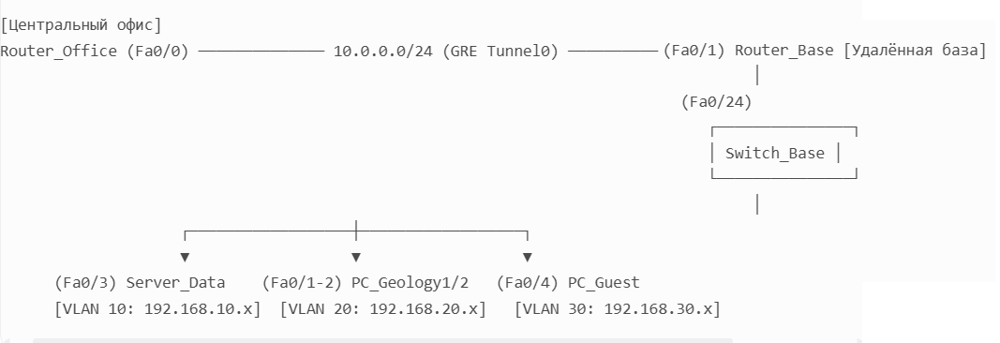

#  Проектная работа

# Тема: Спутниково-проводная сеть для удалённых геологических баз

##  Спутниково-проводная сеть для удалённых геологических баз — это гибридная система связи, которая объединяет спутниковые технологии (например, VSAT) с проводными каналами для обеспечения надёжного доступа к данным и управления в труднодоступных регионах.

##  Схема сети: спутниково‑проводная сеть для удалённой геологической базы

Компоненты сети

1. Удалённая геологическая база:
   
    • Router_Base (Cisco 1941) — маршрутизатор, выполняющий роль спутникового терминала;
   
    • Switch_Base (Cisco 2960) — коммутатор с поддержкой VLAN;
   
    • PC_Geology1, PC_Geology2 — рабочие станции геологов (подключены к VLAN 20);
   
    • Server_Data — сервер хранения данных (подключён к VLAN 10);
   
    • PC_Guest — гостевая рабочая станция (подключена к VLAN 30).

2. Центральный офис:
   
    • Router_Office (Cisco 1941) — главный маршрутизатор офиса;
   
    • Server_Central — центральный сервер (корпоративная база данных, ГИС).

3. Спутниковый канал: GRE‑туннель между Router_Base и Router_Office.

## Протоколы и сервисы

    • VLAN: сегментация сети на три логических сегмента.
    
    • DHCP: автоматическая раздача IP‑адресов в каждой VLAN.
     
    • GRE‑туннель: имитация спутникового канала между Router_Base и Router_Office.
    
    • Router‑on‑a‑Stick: маршрутизация между VLAN через под‑интерфейсы на Router_Base.

## Логическая топология и ip-адресация

|Устройство |	Интерфейс	|IP‑адрес / Сеть	| Назначение
|:----------|:----------|:------------|:----------|
|Router_Office|	Fa0/0	|172.16.1.1/24|	Локальная сеть офиса|
|Router_Office|	Tunnel0 |	10.0.0.2/24	|GRE‑туннель к базе|
|Router_Base |	Fa0/0.10 (VLAN 10)	| 192.168.10.1/24 |	Управление, серверы|
|- |	Fa0/0.20 (VLAN 20)	| 192.168.20.1/24	Геологи, датчики|
|- |	Fa0/0.30 (VLAN 30)	|192.168.30.1/24	Гостевая сеть|
|- |	Fa0/1	|— (источник туннеля)	|Подключение к спутнику|
|- |	Tunnel0	|10.0.0.1/24|	GRE‑туннель к офису|
|Server_Data	|NIC|	DHCP (из пула 192.168.10.0/24)	|Хранение данных разведки|
|PC_Geology1|	NIC|	DHCP (из пула 192.168.20.0/24)	|Работа геологов|
|PC_Geology2	|NIC|	DHCP (из пула 192.168.20.0/24)	|Работа геологов|
|PC_Guest	|NIC|	DHCP (из пула 192.168.30.0/24)	|Гостевой доступ|
|Server_Central	|NIC	|172.16.1.10/24	|Корпоративная БД, ГИС|
	

## VLAN‑конфигурация на Switch_Base

|Порт коммутатора	|VLAN	|Назначение|
|:----------|:----------|:------------|
|Fa0/1–2	|20 (Geology)	|Рабочие станции геологов|
|Fa0/3	|10 (Management)	|Сервер данных|
|Fa0/4	|30 (Guest)|	Гостевые устройства|
|Fa0/24	|Trunk (10,20,30)	|Соединение с Router_Base|

## Создание сети и настройка параметров устройств

1.Добавьте устройства:

•Перетащите в рабочую область:

•2 маршрутизатора (Cisco 1941) → назовите Router_Office, Router_Base.

•Коммутатор (Cisco 2960) → Switch_Base.

•3 ПК → PC_Geology1, PC_Geology2, PC_Guest.

•2 сервера → Server_Data, Server_Central.

2.Соедините устройства:

•Соедините Router_Office Fa0/0 с Router_Base Fa0/1 (используйте медный прямой кабель).

•Соедините Router_Base Fa0/0 с Switch_Base Fa0/24 (медный прямой кабель).

•Подключите:

•Server_Data → Switch_Base Fa0/3.

•PC_Geology1 → Switch_Base Fa0/1.

•PC_Geology2 → Switch_Base Fa0/2.

•PC_Guest → Switch_Base Fa0/4.

•Server_Central → свободный порт Router_Office.

3.Настройте VLAN на Switch_Base:

•Перейдите в CLI коммутатора и выполните команды из предыдущего ответа (создание VLAN 10, 20, 30 и назначение портов).

4.Настройте Router_Base:

•Создайте под интерфейсы для VLAN (Fa0/0.10, Fa0/0.20, Fa0/0.30) с инкапсуляцией dot1Q.

•Настройте GRE туннель (Tunnel0) с IP 10.0.0.1.

•Настройте DHCP пулы для каждой VLAN.

5.Настройте Router_Office:

•Назначьте IP 172.16.1.1 на Fa0/0.

•Настройте GRE туннель (Tunnel0) с IP 10.0.0.2.

## Проверка конфигурации

•Убедитесь, что ПК получают IP адреса по DHCP.

•Выполните ping между PC_Geology1 и Server_Central.

## Выводы и результаты

Эта схема полностью соответствует требованиям проекта:

•реализует VLAN для сегментации трафика (управление, геология, гости);

•использует DHCP для автоматической настройки IP адресов;

•имитирует спутниковый канал через GRE туннель;

•обеспечивает связь между удалённой базой и центральным офисом.

Файл лабораторной работы Cisco PT [здесь](lab11_v1.pkt).
