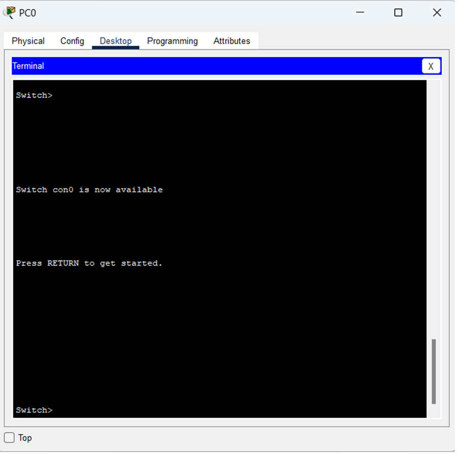
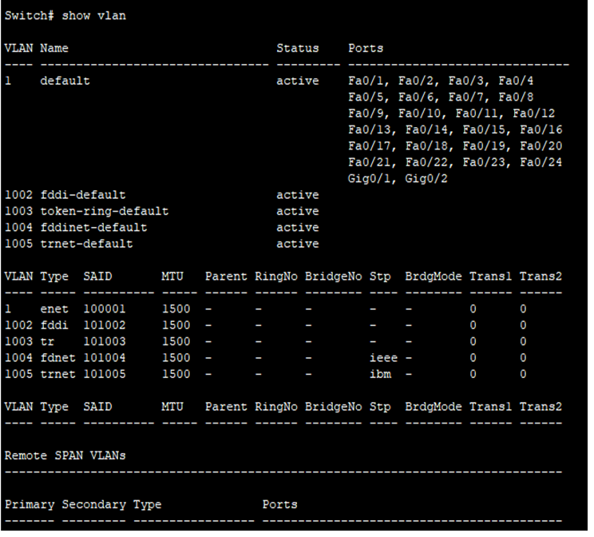
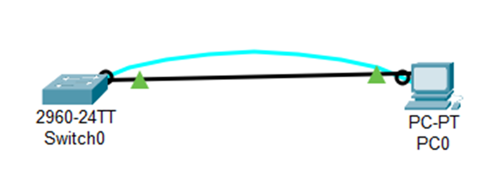
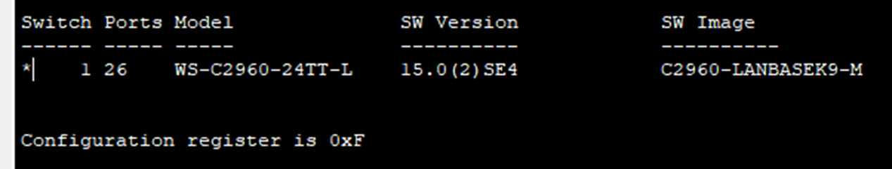
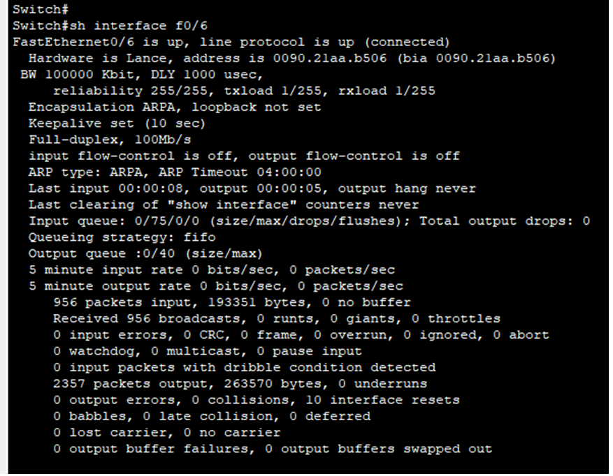

#  Базовая настройка коммутатора

###  Задание:

  1. Проверка конфигурации коммутатора по умолчанию;
  2. Создание сети и настройка основных параметров устройства;
  3. Проверка сетевых подключений;

###  Исходные данные:

| Устройство       | Интерфейс      | IP-адрес / префикс       |
|-----------------:|:---------------|-------------------------:|
| S1               | Vlan 1         | 192.168.1.2 /24          |
| PC-A             | NIC            | 192.168.1.10 /24         |

###  Решение:

# Часть 1. Создание сети и проверка настроек коммутатора по умолчанию

В первой части лабораторной работы вам предстоит настроить топологию сети и проверить настройку коммутатора по умолчанию.

###  1. Создайте сеть согласно топологии.

  a.  Подсоедините консольный кабель, как показано в топологии. На данном этапе не подключайте кабель Ethernet компьютера PC-A.
  

  b.  Установите консольное подключение к коммутатору с компьютера PC-A с помощью Tera Term или другой программы эмуляции терминала.
  

Ответы на вопросы:
1) Почему нужно использовать консольное подключение для первоначальной настройки коммутатора?
- данный метод подключения позволяет получить доступ к устройству даже без настройки сетевых сервисов
2) Почему нельзя подключиться к коммутатору через Telnet или SSH?
- В отличие от консольного подключения для SSH или Telnet -подключений на устройстве должны быть активны сетевые службы, включая активный интерфейс с настроенным адресом.

###  2. Проверьте настройки коммутатора по умолчанию..
a.	Введите команду enable, чтобы войти в привилегированный режим EXEC.

b.	Изучите текущий файл running configuration [здесь](config_0.txt)

Ответы на вопросы:
Сколько интерфейсов FastEthernet имеется на коммутаторе 2960? - 24
Сколько интерфейсов Gigabit Ethernet имеется на коммутаторе 2960? - 2
Каков диапазон значений, отображаемых в vty-линиях? - 0-15

c.	Изучите файл загрузочной конфигурации (startup configuration), который содержится в энергонезависимом ОЗУ (NVRAM).

Почему появляется это сообщение? - Файл загрузочной конфигурации отображает конфигурацию, которая будет применена на устройстве после перезагрузки.

d.	Изучите характеристики SVI для VLAN 1: interface Vlan1

Назначен ли IP-адрес сети VLAN 1? — нет
Какой MAC-адрес имеет SVI?  - адрес не назначен.
Данный интерфейс включен? - отключен

e.	Изучите IP-свойства интерфейса SVI сети VLAN 1.

Какие выходные данные вы видите? – статус, порты, размер MTU

f.	Подсоедините кабель Ethernet компьютера PC-A к порту 6 на коммутаторе и изучите IP-свойства интерфейса SVI сети VLAN 1. Дождитесь согласования параметров скорости и дуплекса между коммутатором и ПК.

g.	Изучите сведения о версии ОС Cisco IOS на коммутаторе.

Ответы на вопросы:
Под управлением какой версии ОС Cisco IOS работает коммутатор? - Version 15.0(2)SE4
Как называется файл образа системы? - System image file is "flash:c2960-lanbasek9-mz.150-2.SE4.bin"

h.	Изучите свойства по умолчанию интерфейса FastEthernet, который используется компьютером PC-A.
Switch# show interface f0/6

Интерфейс включен или выключен? - включен
Что нужно сделать, чтобы включить интерфейс? - подключится к порту
Какой MAC-адрес у интерфейса? не задан
Какие настройки скорости и дуплекса заданы в интерфейсе? Full-duplex, 100Mb/s

i.	Изучите флеш-память.
Выполните одну из следующих команд, чтобы изучить содержимое флеш-каталога:
Switch# show flash 
Switch# dir flash

Switch# show flash
Directory of flash:/
1 -rw- 4670455 <no date> 2960-lanbasek9-mz.150-2.SE4.bin
64016384 bytes total (59345929 bytes free)

Какое имя присвоено образу Cisco IOS? - 2960-lanbasek9-mz.150-2.SE4

  # Часть 2. Настройка базовых параметров сетевых устройств

Во второй части необходимо будет настроить основные параметры коммутатора и компьютера.
 
  ###  1. Настройте базовые параметры коммутатора.

  a.	В режиме глобальной конфигурации скопируйте следующие базовые параметры конфигурации и вставьте их в файл на коммутаторе S1.
  
no ip domain-lookup
hostname S1
service password-encryption
enable secret class
banner motd # Unauthorized access is strictly prohibited. #

b.	Назначьте IP-адрес интерфейсу SVI на коммутаторе. Благодаря этому вы получите возможность удаленного управления коммутатором.

Прежде чем вы сможете управлять коммутатором S1 удаленно с компьютера PC-A, коммутатору нужно назначить IP-адрес. Согласно конфигурации по умолчанию коммутатором можно управлять через VLAN 1.

c.	Доступ через порт консоли также следует ограничить  с помощью пароля. Используйте cisco в качестве пароля для входа в консоль в этом задании. Конфигурация по умолчанию разрешает все консольные подключения без пароля. Чтобы консольные сообщения не прерывали выполнение команд, используйте параметр logging synchronous.

S1(config)# line con 0
S1(config-line)# logging synchronous

d.	Настройте каналы виртуального соединения для удаленного управления (vty), чтобы коммутатор разрешил доступ через Telnet. Если не настроить пароль VTY, будет невозможно подключиться к коммутатору по протоколу Telnet.

Для чего нужна команда login? — команда требует ввода пароля при подключении по консоли

###  2. Настройте IP-адрес на компьютере PC-A.
Назначьте компьютеру IP-адрес и маску подсети в соответствии с таблицей адресации.

| Устройство       | Интерфейс      | IP-адрес / префикс       |
|-----------------:|:---------------|-------------------------:|
| S1               | Vlan 1         | 192.168.1.2 /24          |
| PC-A             | NIC            | 192.168.1.10 /24         |

 # Часть 3. Проверка сетевых подключений
В третьей части лабораторной работы вам предстоит проверить и задокументировать конфигурацию коммутатора, протестировать сквозное соединение между компьютером PC-A и коммутатором S1, а также протестировать возможность удаленного управления коммутатором.

###  1. Отобразите конфигурацию коммутатора.

a.	Используйте консольное подключение на компьютере PC-A для отображения и проверки конфигурации коммутатора. Команда show run позволяет постранично отобразить всю текущую конфигурацию.

 Файл текущей конфигурации [здесь](config_1.txt).

 b.	Проверьте параметры VLAN 1.
 
S1# show interface vlan 1
S1#show interface vlan 1
Vlan1 is up, line protocol is up
Hardware is CPU Interface, address is 00e0.b051.4598 (bia 00e0.b051.4598)
Internet address is 192.168.1.2/24
MTU 1500 bytes, BW 100000 Kbit, DLY 1000000 usec,
reliability 255/255, txload 1/255, rxload 1/255
Encapsulation ARPA, loopback not set
ARP type: ARPA, ARP Timeout 04:00:00
Last input 21:40:21, output never, output hang never
Last clearing of "show interface" counters never
Input queue: 0/75/0/0 (size/max/drops/flushes); Total output drops: 0
Queueing strategy: fifo
Output queue: 0/40 (size/max)
5 minute input rate 0 bits/sec, 0 packets/sec
5 minute output rate 0 bits/sec, 0 packets/sec
1682 packets input, 530955 bytes, 0 no buffer
Received 0 broadcasts (0 IP multicast)
0 runts, 0 giants, 0 throttles
0 input errors, 0 CRC, 0 frame, 0 overrun, 0 ignored
563859 packets output, 0 bytes, 0 underruns
0 output errors, 23 interface resets
0 output buffer failures, 0 output buffers swapped out

Какова полоса пропускания этого интерфейса? - MTU 1500 bytes.

###  2. Протестируйте сквозное соединение, отправив эхо-запрос.

a.	В командной строке компьютера PC-A с помощью утилиты ping проверьте связь сначала с адресом PC-A.

C:\>ping 192.168.1.10

Pinging 192.168.1.10 with 32 bytes of data:

Reply from 192.168.1.10: bytes=32 time=1ms TTL=128
Reply from 192.168.1.10: bytes=32 time=4ms TTL=128
Reply from 192.168.1.10: bytes=32 time=3ms TTL=128
Reply from 192.168.1.10: bytes=32 time=4ms TTL=128

Ping statistics for 192.168.1.10:
Packets: Sent = 4, Received = 4, Lost = 0 (0% loss),
Approximate round trip times in milli-seconds:
Minimum = 1ms, Maximum = 4ms, Average = 3ms

b.	Из командной строки компьютера PC-A отправьте эхо-запрос на административный адрес интерфейса SVI коммутатора S1.
C:\> ping 192.168.1.2

Pinging 192.168.1.2 with 32 bytes of data:

Reply from 192.168.1.2: bytes=32 time<1ms TTL=255
Reply from 192.168.1.2: bytes=32 time<1ms TTL=255
Reply from 192.168.1.2: bytes=32 time<1ms TTL=255
Reply from 192.168.1.2: bytes=32 time<1ms TTL=255

Ping statistics for 192.168.1.2:
Packets: Sent = 4, Received = 4, Lost = 0 (0% loss),
Approximate round trip times in milli-seconds:
Minimum = 0ms, Maximum = 0ms, Average = 0ms

###  3. Проверьте удаленное управление коммутатором S1.

a.	Откройте Tera Term или другую программу эмуляции терминала с возможностью Telnet. 
b.	Выберите сервер Telnet и укажите адрес управления SVI для подключения к S1.  Пароль: cisco.
c.	После ввода пароля cisco вы окажетесь в командной строке пользовательского режима. Для перехода в исполнительский режим EXEC введите команду enable и используйте секретный пароль class.
d.	Сохраните конфигурацию. - Файл текущей конфигурации [здесь](Telnet_config_1.txt).

# Вопросы для повторения

1.	Зачем необходимо настраивать пароль VTY для коммутатора?
Чтобы ограничить удаленный доступ к устройству через Telnet или SSH.

3.	Что нужно сделать, чтобы пароли не отправлялись в незашифрованном виде?
Чтобы зашифровать пароли, нужно воспользоваться командой service password-encryption в режиме глобальной конфигурации.

Файл лабораторной работы Cisco PT [здесь](lab1.pkt).
